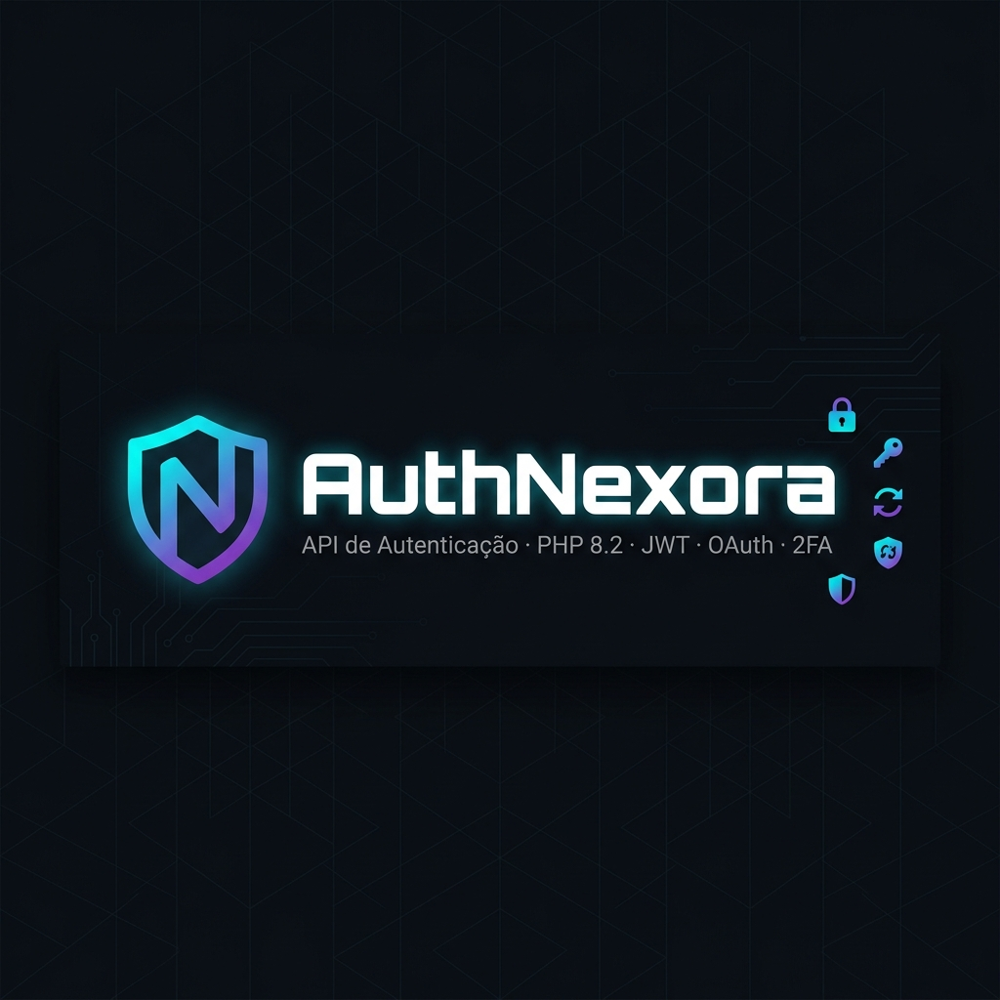
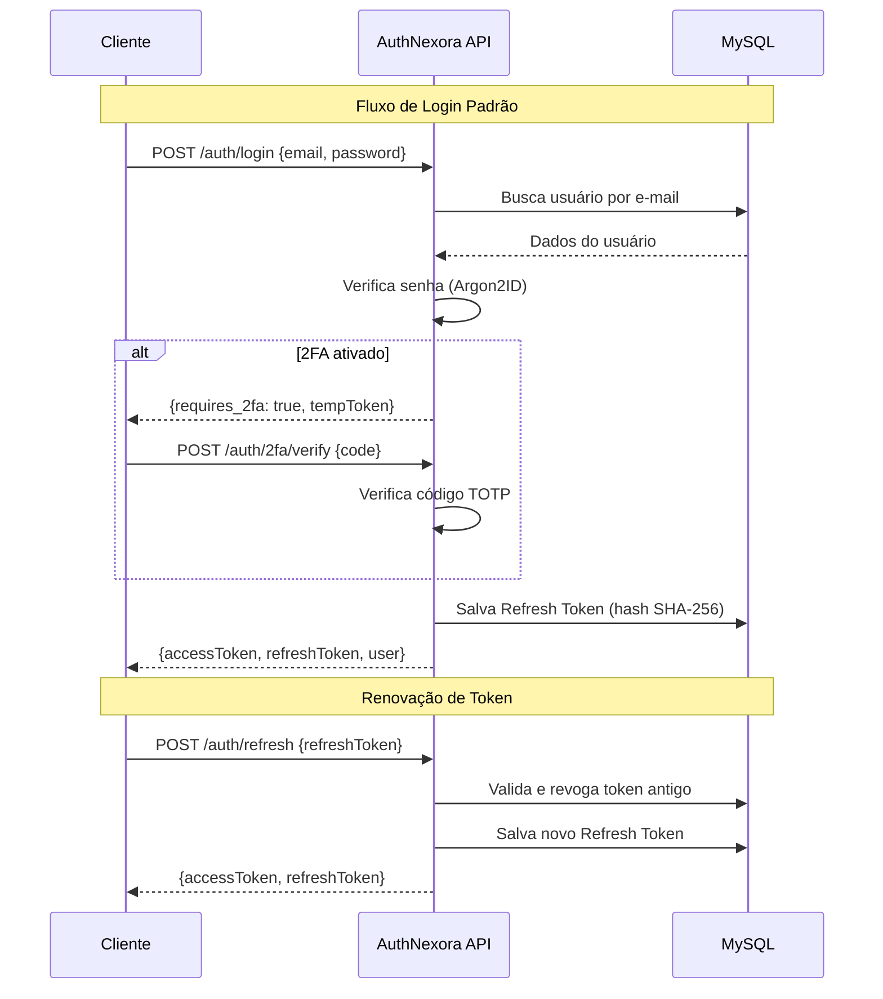

<p align="center">
  
</p>

<p align="center">
  <a href="https://www.php.net/"></a>
  <a href="https://www.mysql.com/"></a>
  <a href="https://swagger.io/"></a>
  <a href="https://www.docker.com/"></a>
  
  
  
  
</p>

---

## 🥋 O que é o AuthNexora?

**AuthNexora** é uma API REST de autenticação robusta, modular e sem dependência de framework, desenvolvida em **PHP 8.2+** puro com **MySQL via PDO**. Projetada para ser o núcleo de segurança de sistemas de gestão — especialmente academias de artes marciais (Jiu-Jitsu, No-Gi, Judô, Wrestling) — ela entrega um sistema de identidade completo, seguro e extensível.

> **AuthNexora** é parte do ecossistema **Nexora**, uma plataforma voltada à gestão profissional de academias de artes suaves.

---

## 🎯 Objetivos

- 🔐 Prover autenticação segura e completa como serviço independente
- 🏗️ Manter arquitetura limpa e de fácil manutenção (Controller → Service → Repository)
- 🔄 Suportar múltiplos métodos de login (senha, Google OAuth, 2FA)
- 📖 Ser totalmente documentado via OpenAPI/Swagger
- 🐳 Ser executável via Docker com integração ao pipeline CI/CD

---

## ⚡ Funcionalidades

| Recurso | Status |
|---|---|
| Registro de usuário (com campos de academia) | ✅ |
| Login com e-mail e senha | ✅ |
| JWT Access Token (HS256) | ✅ |
| Refresh Token com Token Rotation | ✅ |
| Logout (revogação de Refresh Token) | ✅ |
| Verificação de e-mail (via JWT) | ✅ |
| Recuperação de senha (SHA-256 + e-mail) | ✅ |
| Autenticação via Google OAuth 2.0 | ✅ |
| Autenticação de dois fatores (TOTP/2FA) | ✅ |
| Rate Limiting por IP | ✅ |
| Bloqueio de conta após tentativas falhas | ✅ |
| Documentação Swagger UI interativa | ✅ |
| Templates de e-mail em HTML | ✅ |
| Containerização Docker | ✅ |

---

## 🛠️ Tecnologias

| Categoria | Tecnologia | Versão |
|---|---|---|
| Linguagem | PHP (strict, readonly, PSR-4) | 8.2+ |
| Banco de Dados | MySQL via PDO | 8.0+ |
| Autenticação JWT | Implementação própria HS256 | — |
| E-mail | PHPMailer (SMTP/SSL) | ^6.9 |
| Google OAuth | google/apiclient | ^2.19 |
| 2FA (TOTP) | robthree/twofactorauth | ^3.0 |
| QR Code | chillerlan/php-qrcode | ^6.0 |
| OpenAPI/Swagger | zircote/swagger-php | ^4.10 |
| Variáveis de Ambiente | vlucas/phpdotenv | ^5.6 |
| Container | Docker (php:8.2-fpm) | — |

---

## 🏛️ Arquitetura

O projeto segue uma arquitetura em camadas sem framework, com injeção de dependência manual:

```
┌─────────────────────────────────────────────────────────┐
│                      Cliente HTTP                        │
└─────────────────────┬───────────────────────────────────┘
                       │
┌─────────────────────▼───────────────────────────────────┐
│              public/index.php (Roteador)                 │
│         CORS · Bootstrapping · Despacho de rotas        │
└──────┬──────────────────────────────────────────────────┘
       │
┌──────▼──────────────┐
│   AuthMiddleware    │  ← Valida JWT Bearer Token
└──────┬──────────────┘
       │
┌──────▼──────────────────────────────────────────────────┐
│                    Controllers                           │
│  AuthController · PasswordController                    │
│  GoogleAuthController · TwoFactorAuthController         │
└──────┬──────────────────────────────────────────────────┘
       │
┌──────▼──────────────────────────────────────────────────┐
│                     Services                            │
│  AuthService · JwtService · EmailService               │
│  GoogleAuthService · PasswordResetService              │
│  RateLimitService                                       │
└──────┬──────────────────────────────────────────────────┘
       │
┌──────▼──────────────────────────────────────────────────┐
│                   Repositories                          │
│  UserRepository · RefreshTokenRepository               │
│  PasswordResetRepository                               │
└──────┬──────────────────────────────────────────────────┘
       │
┌──────▼──────────────┐
│   MySQL (PDO)       │  ← users · refresh_tokens · password_resets
└─────────────────────┘
```

> 📖 Diagrama completo e detalhes de arquitetura: [`docs/architecture.md`](docs/architecture.md)

---

## 📁 Estrutura de Pastas

```
AuthNexora/
│
├── api/                          # Código-fonte da API
│   ├── public/
│   │   └── index.php             # Entry point — roteador e bootstrapping
│   ├── src/
│   │   ├── Config/
│   │   │   ├── Database.php      # Singleton de conexão PDO
│   │   │   └── env.php           # Mapeamento de variáveis de ambiente
│   │   ├── Controllers/
│   │   │   ├── AuthController.php
│   │   │   ├── GoogleAuthController.php
│   │   │   ├── PasswordController.php
│   │   │   └── TwoFactorAuthController.php
│   │   ├── Services/
│   │   │   ├── AuthService.php
│   │   │   ├── JwtService.php
│   │   │   ├── EmailService.php
│   │   │   ├── GoogleAuthService.php
│   │   │   ├── PasswordResetService.php
│   │   │   └── RateLimitService.php
│   │   ├── Repositories/
│   │   │   ├── UserRepository.php
│   │   │   ├── RefreshTokenRepository.php
│   │   │   └── PasswordResetRepository.php
│   │   ├── Middleware/
│   │   │   └── AuthMiddleware.php
│   │   ├── Helpers/
│   │   │   ├── Request.php       # Parsing de JSON body e Bearer token
│   │   │   └── Response.php      # Serialização JSON padronizada
│   │   ├── Providers/
│   │   │   └── ChillerlanQRCodeProvider.php
│   │   └── Docs/
│   │       └── OpenApi.php       # Anotações OpenAPI 3.0
│   ├── templates/
│   │   ├── welcome_email.html    # Template de boas-vindas / verificação
│   │   └── forgot_password_email.html
│   ├── storage/
│   │   └── rate_limit/           # Arquivos JSON do rate limiter por IP
│   ├── Dockerfile
│   ├── composer.json
│   └── .env.example              # Modelo de variáveis de ambiente
│
└── docs/                         # Documentação completa do projeto
    ├── SUMMARY.md
    ├── architecture.md
    ├── authentication.md
    ├── authorization.md
    ├── api.md
    ├── database.md
    ├── docker.md
    ├── deployment.md
    ├── environment.md
    ├── security.md
    ├── middleware.md
    ├── controllers.md
    ├── services.md
    ├── repositories.md
    ├── workflows.md
    ├── troubleshooting.md
    ├── contributing.md
    └── changelog.md
```

---

## 🚀 Executando Localmente (XAMPP)

### Pré-requisitos

- XAMPP com PHP 8.2+ e MySQL
- Composer instalado globalmente
- Conta Google Cloud (para OAuth) — opcional

### Passo a passo

**1. Clone o repositório**
```bash
git clone https://github.com/ReiArthurjpg/AuthNexora.git
cd AuthNexora/api
```

**2. Instale as dependências**
```bash
composer install
```

**3. Configure o ambiente**
```bash
cp .env.example .env
# Edite .env com suas credenciais locais
```

**4. Crie o banco de dados**

Execute os scripts SQL (disponíveis no [repositório CICD](https://github.com/ReiArthurjpg/CICD)):
```
CICD/database/schemas/authnexora/001_initial_schema.sql
CICD/database/seeds/authnexora/001_admin_user.sql
```

Ou use o schema incluído na seção de banco de dados da documentação:
👉 [`docs/database.md`](docs/database.md)

**5. Inicie o XAMPP**

Configure o Virtual Host apontando para `AuthNexora/api/public/` ou acesse via:
```
http://localhost/AuthNexora/api/public/
```

**6. Verifique o serviço**
```bash
curl http://localhost:8080/
# {"name":"Nexora Auth API","version":"1.0.0","status":"running"}
```

---

## 🐳 Docker

> A infraestrutura Docker completa (Nginx, MySQL, Composer) está centralizada no repositório **[CICD](https://github.com/ReiArthurjpg/CICD)**.
> Este repositório contém apenas o `Dockerfile` da aplicação PHP.

```bash
# Clone o repositório CICD
git clone https://github.com/ReiArthurjpg/CICD.git
cd CICD

# Suba toda a stack
docker compose up -d
```

> 📖 Guia completo: [`docs/docker.md`](docs/docker.md)

---

## ⚙️ Variáveis de Ambiente

Crie o arquivo `api/.env` a partir do modelo abaixo:

```env
# ── Aplicação ─────────────────────────────────────────────
APP_BASE_URL=http://localhost:8080
FRONTEND_URL=http://localhost:3000
FRONTEND_RESET_URL=http://localhost:3000/reset-password
FRONTEND_VERIFY_EMAIL_URL=http://localhost:3000/verify-email

# ── Banco de Dados ─────────────────────────────────────────
DB_HOST=localhost
DB_PORT=3306
DB_DATABASE=authnexora
DB_USERNAME=root
DB_PASSWORD=

# ── JWT ────────────────────────────────────────────────────
JWT_SECRET=gere-uma-chave-forte-aqui        # mínimo 32 caracteres
JWT_ISSUER=authnexora-api
JWT_EXPIRES_IN=3600                          # segundos (padrão: 1h)

# ── E-mail (SMTP) ──────────────────────────────────────────
MAIL_HOST=smtp.gmail.com
MAIL_PORT=465
MAIL_USERNAME=seu-email@gmail.com
MAIL_PASSWORD=sua-senha-de-app
MAIL_FROM_EMAIL=seu-email@gmail.com
MAIL_FROM_NAME=Nexora

# ── Google OAuth ───────────────────────────────────────────
GOOGLE_CLIENT_ID=seu-client-id.apps.googleusercontent.com
GOOGLE_CLIENT_SECRET=seu-client-secret
```

> ⚠️ **Nunca commite o `.env` com credenciais reais.** O arquivo está incluído no `.gitignore`.

> 📖 Referência completa de todas as variáveis: [`docs/environment.md`](docs/environment.md)

---

## 🗄️ Banco de Dados

O sistema utiliza **3 tabelas** no MySQL:

| Tabela | Descrição |
|---|---|
| `users` | Usuários do sistema com dados de academia e perfil de artes marciais |
| `refresh_tokens` | Tokens de sessão (Token Rotation, TTL 7 dias) |
| `password_resets` | Tokens de reset de senha (SHA-256, TTL 30 min) |

> 📖 Schema SQL completo, diagrama ER e descrição de cada campo: [`docs/database.md`](docs/database.md)

---

## 🔐 Fluxo de Autenticação



> 📖 Todos os fluxos documentados com diagramas: [`docs/authentication.md`](docs/authentication.md)

---

## 🗺️ Endpoints da API

| Método | Endpoint | Auth | Descrição |
|---|---|---|---|
| `GET` | `/` | — | Health check |
| `GET` | `/swagger` | — | Interface Swagger UI |
| `GET` | `/api-docs` | — | JSON OpenAPI 3.0 |
| `POST` | `/auth/signup` | JWT Admin | Cria usuário |
| `POST` | `/auth/login` | — | Autentica |
| `GET` | `/auth/me` | JWT | Perfil do usuário |
| `PUT` | `/auth/me` | JWT | Atualiza perfil |
| `POST` | `/auth/logout` | — | Revoga sessão |
| `POST` | `/auth/refresh` | — | Renova tokens |
| `GET` | `/auth/verify-email` | — | Verifica e-mail |
| `GET` | `/auth/google` | — | URL OAuth Google |
| `GET` | `/auth/google/callback` | — | Callback OAuth |
| `POST` | `/auth/forgot-password` | — | Solicita reset |
| `GET` | `/auth/reset-password/validate` | — | Valida token |
| `POST` | `/auth/reset-password` | — | Redefine senha |
| `POST` | `/auth/2fa/verify` | JWT (2fa) | Verifica TOTP |
| `POST` | `/2fa/generate` | JWT | Gera QR Code |
| `POST` | `/2fa/enable` | JWT | Ativa 2FA |
| `POST` | `/2fa/disable` | JWT | Desativa 2FA |

> 📖 Referência completa com exemplos de request/response e cURL: [`docs/api.md`](docs/api.md)

---

## 📖 Swagger UI

A documentação interativa está disponível em:

```
http://localhost:8080/swagger
```

O JSON OpenAPI pode ser obtido em:
```
http://localhost:8080/api-docs
```

---

## 💡 Exemplos de Requisição

**Login:**
```bash
curl -X POST http://localhost:8080/auth/login \
  -H "Content-Type: application/json" \
  -d '{"email": "admin@nexora.com", "password": "SenhaForte@123"}'
```

**Obter perfil autenticado:**
```bash
curl http://localhost:8080/auth/me \
  -H "Authorization: Bearer SEU_ACCESS_TOKEN"
```

**Renovar token:**
```bash
curl -X POST http://localhost:8080/auth/refresh \
  -H "Content-Type: application/json" \
  -d '{"refreshToken": "SEU_REFRESH_TOKEN"}'
```

> 📖 Exemplos completos para todos os endpoints: [`docs/api.md`](docs/api.md)

---

## 🔒 Segurança

| Mecanismo | Implementação |
|---|---|
| Hash de senhas | Argon2ID (`PASSWORD_ARGON2ID`) |
| JWT | HS256 — assinatura HMAC-SHA256 |
| Refresh Token | SHA-256 hash armazenado (nunca o token bruto) |
| Token Rotation | Refresh token revogado a cada uso |
| Bloqueio de conta | Após 3 tentativas falhas consecutivas |
| Rate Limiting | 5 tentativas por IP / 60 segundos |
| Reset de senha | Token SHA-256 com TTL de 30 minutos |
| CORS | Origem validada dinamicamente |
| SQL Injection | PDO com prepared statements em 100% das queries |

> 📖 Análise completa de segurança, recomendações e known issues: [`docs/security.md`](docs/security.md)

---

## 📚 Documentação Completa

| Documento | Descrição |
|---|---|
| [`docs/SUMMARY.md`](docs/SUMMARY.md) | Índice completo da documentação |
| [`docs/architecture.md`](docs/architecture.md) | Arquitetura, decisões de design e estrutura |
| [`docs/authentication.md`](docs/authentication.md) | Todos os fluxos de autenticação com diagramas |
| [`docs/authorization.md`](docs/authorization.md) | JWT, escopos e proteção de rotas |
| [`docs/api.md`](docs/api.md) | Referência completa de endpoints |
| [`docs/database.md`](docs/database.md) | Schema SQL, diagrama ER e seeders |
| [`docs/docker.md`](docs/docker.md) | Containerização e infraestrutura |
| [`docs/deployment.md`](docs/deployment.md) | Deploy local e produção |
| [`docs/environment.md`](docs/environment.md) | Variáveis de ambiente |
| [`docs/security.md`](docs/security.md) | Segurança e boas práticas |
| [`docs/middleware.md`](docs/middleware.md) | Middleware de autenticação |
| [`docs/controllers.md`](docs/controllers.md) | Referência dos controllers |
| [`docs/services.md`](docs/services.md) | Referência dos services |
| [`docs/repositories.md`](docs/repositories.md) | Referência dos repositories |
| [`docs/workflows.md`](docs/workflows.md) | Workflows detalhados |
| [`docs/troubleshooting.md`](docs/troubleshooting.md) | Solução de problemas |
| [`docs/contributing.md`](docs/contributing.md) | Guia de contribuição |
| [`docs/changelog.md`](docs/changelog.md) | Histórico de versões |

---

## 🗺️ Roadmap

- [ ] Autenticação com Apple ID
- [ ] Refresh Token multi-dispositivo com gerenciamento de sessões
- [ ] Webhook de eventos de autenticação
- [ ] Suporte a Redis para Rate Limiting distribuído
- [ ] Migrações de banco de dados automatizadas
- [ ] Testes automatizados (PHPUnit)
- [ ] Login passwordless via magic link
- [ ] SDK cliente em TypeScript

---

## 📄 Licença

Este projeto está licenciado sob a **MIT License** — veja o arquivo [LICENSE](LICENSE) para detalhes.

---

## 👤 Autor

<p align="center">
  Desenvolvido com 🥋 por <a href="https://github.com/ReiArthurjpg"><strong>ReiArthurjpg</strong></a><br>
  Parte do ecossistema <strong>Nexora</strong> — Gestão inteligente para academias de artes marciais
</p>

<p align="center">
  <a href="https://github.com/ReiArthurjpg/AuthNexora/issues">🐛 Reportar Bug</a> ·
  <a href="https://github.com/ReiArthurjpg/AuthNexora/issues">✨ Solicitar Feature</a> ·
  <a href="docs/contributing.md">🤝 Contribuir</a>
</p>
