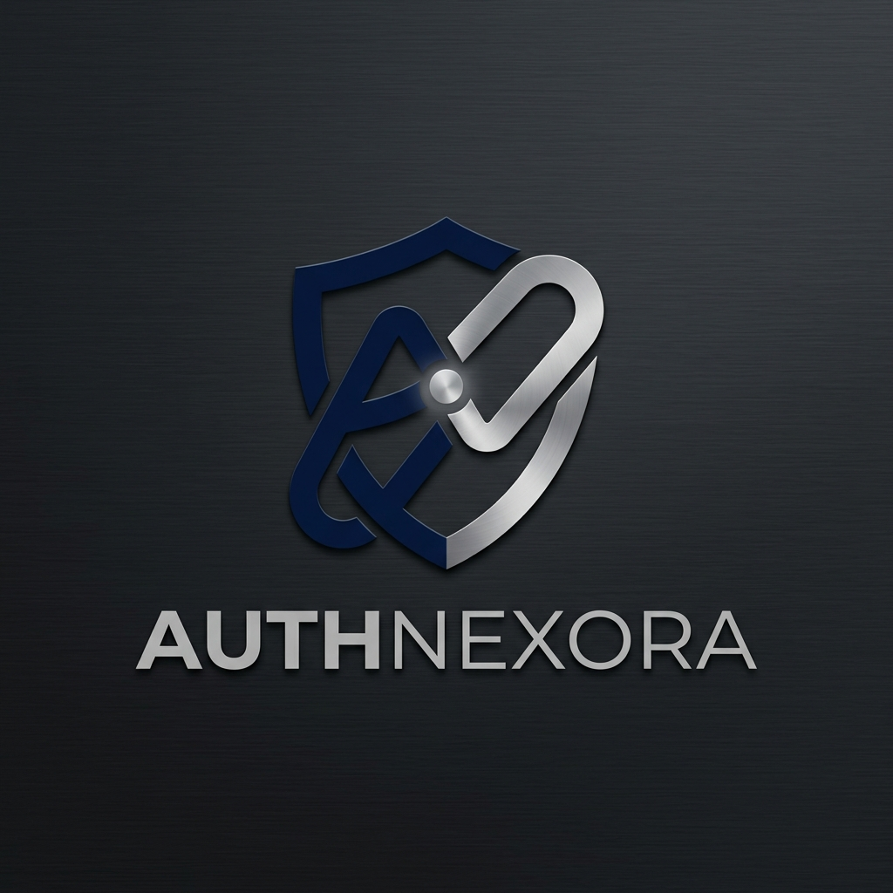

  

# AuthNexora

**AuthNexora** é uma API de autenticação robusta e modular desenvolvida em PHP 8.2+ e MySQL. Projetada para ser o coração de sistemas que exigem segurança e escalabilidade, ela oferece fluxos completos de login, registro, recuperação de conta e segurança JWT, tudo documentado com OpenAPI (Swagger).

## 🚀 Visão Geral

Este projeto foi construído com foco em arquitetura limpa e facilidade de integração. As principais responsabilidades incluem:
- Gestão de identidades e usuários.
- Autenticação segura via JSON Web Tokens (JWT).
- Fluxo de recuperação de senha com integração via PHPMailer.
- Documentação interativa para desenvolvedores.

## 📖 Documentação Detalhada

Para instruções completas de instalação, guias técnicos, arquitetura do banco de dados e referências dos endpoints, visite nossa Wiki oficial:

👉 [**Acessar Wiki do AuthNexora**](https://github.com/ReiArthurjpg/AuthNexora/wiki)

---

  Desenvolvido por <a href="https://github.com/ReiArthurjpg">Arthur</a>

