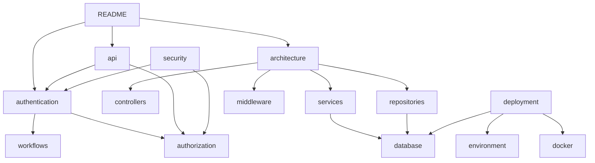

# 📚 Documentação AuthNexora — Índice Geral

> Documentação completa da **API de Autenticação AuthNexora** — parte do ecossistema Nexora para gestão de academias de artes marciais.

---

## 🧭 Navegação

### 🏠 Início
- [README](../README.md) — Visão geral, instalação rápida e exemplos

---

### 🏛️ Arquitetura & Design
- [architecture.md](architecture.md) — Arquitetura em camadas, estrutura de pastas, decisões de design e diagramas
- [workflows.md](workflows.md) — Workflows detalhados: reset de senha, verificação de e-mail, configuração 2FA

---

### 🔐 Autenticação & Autorização
- [authentication.md](authentication.md) — Todos os fluxos de autenticação com diagramas de sequência
- [authorization.md](authorization.md) — JWT, escopos, middleware e proteção de rotas

---

### 🌐 API Reference
- [api.md](api.md) — Referência completa de todos os 19 endpoints com exemplos cURL

---

### 🗄️ Banco de Dados
- [database.md](database.md) — Schema SQL completo das 3 tabelas, diagrama ER e seeders

---

### 🧩 Módulos do Código
- [controllers.md](controllers.md) — Referência dos 4 controllers
- [services.md](services.md) — Referência dos 6 services
- [repositories.md](repositories.md) — Referência dos 3 repositories
- [middleware.md](middleware.md) — AuthMiddleware e validação de escopos

---

### ⚙️ Configuração & Infraestrutura
- [environment.md](environment.md) — Todas as variáveis de ambiente com descrição e exemplos
- [docker.md](docker.md) — Containerização, Dockerfile e integração com o repositório CICD
- [deployment.md](deployment.md) — Deploy local (XAMPP) e produção

---

### 🔒 Segurança
- [security.md](security.md) — Argon2ID, JWT, token rotation, rate limiting, known issues

---

### 🤝 Contribuição & Histórico
- [contributing.md](contributing.md) — Como contribuir, padrões de código e pull requests
- [troubleshooting.md](troubleshooting.md) — Problemas comuns e como resolvê-los
- [changelog.md](changelog.md) — Histórico de versões e mudanças

---

## 🗺️ Mapa de Dependências

---

## 📌 Convenções desta documentação

### Callouts

> [!NOTE]
> Informações contextuais e explicações de comportamento

> [!TIP]
> Boas práticas e sugestões de otimização

> [!IMPORTANT]
> Requisitos críticos e etapas obrigatórias

> [!WARNING]
> Comportamentos inesperados ou pontos de atenção

> [!CAUTION]
> Ações de alto risco que podem causar perda de dados ou falha de segurança

### Emojis usados

| Emoji | Significado |
|---|---|
| 🔐 | Autenticação / segurança |
| 🗄️ | Banco de dados |
| 🌐 | Endpoint / API |
| ⚙️ | Configuração |
| 🐳 | Docker |
| 📧 | E-mail |
| 🔄 | Renovação / refresh |
| 🥋 | Contexto Nexora / artes marciais |
| ⚠️ | Aviso importante |
| ✅ | Implementado / OK |
| ❌ | Não suportado / erro |

---

  <strong>AuthNexora</strong> · Ecossistema Nexora · <a href="https://github.com/ReiArthurjpg">ReiArthurjpg</a>

