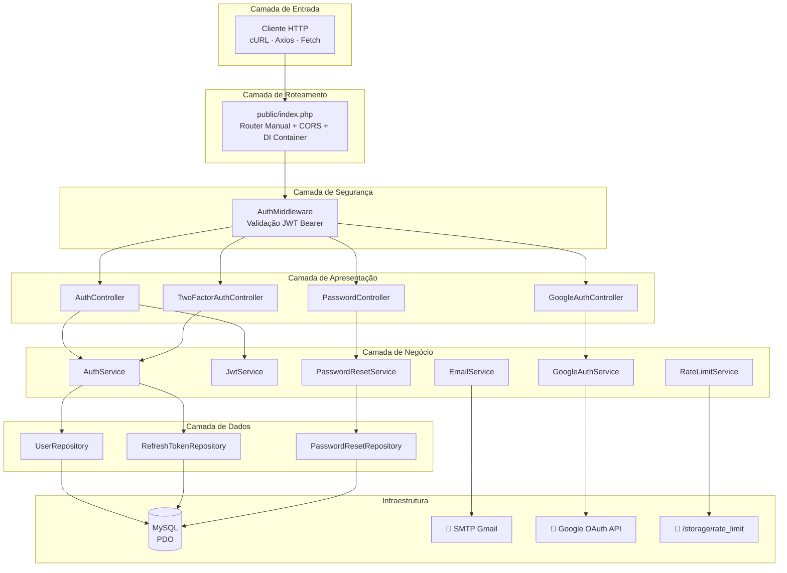
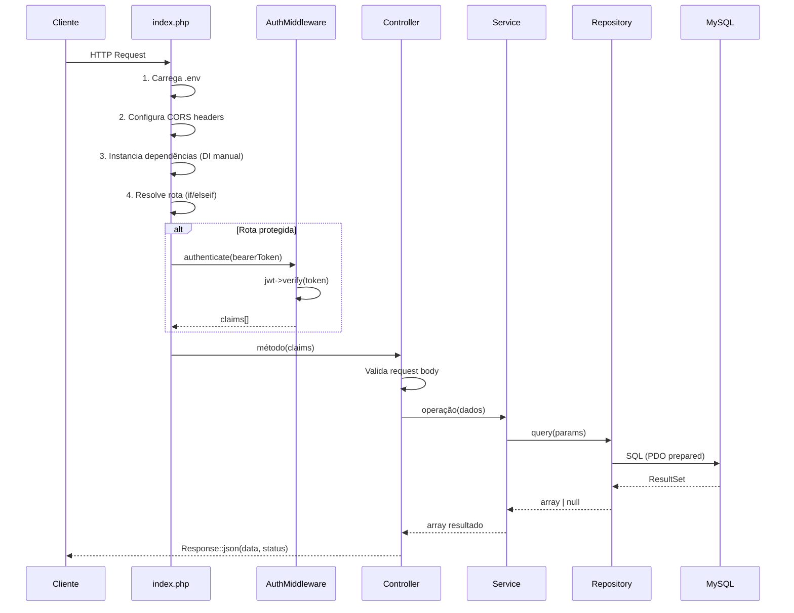

# 🏛️ Arquitetura — AuthNexora

> Visão técnica completa da arquitetura do sistema, decisões de design, fluxo de requisição e estrutura de código.

---

## Visão Geral

O **AuthNexora** é uma API REST construída em **PHP 8.2+ puro**, sem framework. Isso significa que todo roteamento, injeção de dependência e bootstrapping são feitos manualmente, proporcionando máximo controle e mínima abstração.

```
PHP 8.2 + PDO (MySQL) + PSR-4 Autoload + Dotenv
```

---

## Arquitetura em Camadas

O sistema é organizado em **5 camadas** com responsabilidades bem definidas:



---

## Fluxo de uma Requisição



---

## Estrutura de Diretórios Anotada

```
AuthNexora/
│
├── README.md                         ← Documentação principal
│
├── docs/                             ← Documentação técnica completa
│   └── ...
│
└── api/                              ← Código-fonte da API
    │
    ├── public/
    │   ├── index.php                 ← ⭐ Ponto de entrada único
    │   └── info.php                  ← phpinfo() (remover em produção)
    │
    ├── src/                          ← Código PSR-4 (namespace App\)
    │   │
    │   ├── Config/
    │   │   ├── Database.php          ← Singleton PDO (lazy connection)
    │   │   └── env.php               ← Mapeia $_ENV → array tipado
    │   │
    │   ├── Controllers/              ← Camada de apresentação HTTP
    │   │   ├── AuthController.php    ← signup, login, me, logout, refresh, 2fa, verifyEmail
    │   │   ├── GoogleAuthController.php ← login (redirect), callback
    │   │   ├── PasswordController.php   ← forgotPassword, validateToken, resetPassword
    │   │   └── TwoFactorAuthController.php ← generate, enable, disable
    │   │
    │   ├── Services/                 ← Lógica de negócio
    │   │   ├── AuthService.php       ← Orchestrator principal de auth
    │   │   ├── JwtService.php        ← Emissão e verificação JWT (HS256)
    │   │   ├── EmailService.php      ← Envio SMTP via PHPMailer
    │   │   ├── GoogleAuthService.php ← OAuth 2.0 via google/apiclient
    │   │   ├── PasswordResetService.php ← Reset seguro com SHA-256
    │   │   └── RateLimitService.php  ← Limiter por IP via arquivo JSON
    │   │
    │   ├── Repositories/             ← Acesso a dados (SQL puro + PDO)
    │   │   ├── UserRepository.php    ← CRUD de usuários
    │   │   ├── RefreshTokenRepository.php ← Gerenciamento de sessões
    │   │   └── PasswordResetRepository.php ← Tokens de reset
    │   │
    │   ├── Middleware/
    │   │   └── AuthMiddleware.php    ← Proteção de rotas via JWT
    │   │
    │   ├── Helpers/
    │   │   ├── Request.php           ← Parsing de body JSON e Bearer token
    │   │   └── Response.php          ← Serialização JSON padronizada
    │   │
    │   ├── Providers/
    │   │   └── ChillerlanQRCodeProvider.php ← Adapter QR para robthree/2fa
    │   │
    │   └── Docs/
    │       └── OpenApi.php           ← Anotações OpenAPI 3.0 (PHP Attributes)
    │
    ├── templates/                    ← Templates HTML de e-mail
    │   ├── welcome_email.html        ← Boas-vindas + link de verificação
    │   └── forgot_password_email.html ← Recuperação de senha
    │
    ├── storage/
    │   └── rate_limit/              ← Arquivos JSON do rate limiter
    │       └── {sha1_ip}.json       ← ex: a94a8fe5.json
    │
    ├── vendor/                      ← Dependências Composer (git-ignored)
    ├── Dockerfile                   ← Build da imagem PHP 8.2-fpm
    ├── composer.json
    ├── .env                         ← Variáveis de ambiente (git-ignored)
    └── .htaccess                    ← Rewrite rules Apache
```

---

## Injeção de Dependência

O AuthNexora utiliza **injeção de dependência manual** (sem container IoC). Toda a composição do grafo de objetos acontece no `public/index.php`:

```php
// Infraestrutura
$pdo = Database::connection();              // Singleton PDO

// Repositories
$userRepo         = new UserRepository($pdo);
$resetRepo        = new PasswordResetRepository($pdo);
$refreshTokenRepo = new RefreshTokenRepository($pdo);

// Services
$jwt       = new JwtService($env['jwt']['secret'], $env['jwt']['issuer'], $env['jwt']['expires_in']);
$rateLimit = new RateLimitService(5, 60);
$email     = new EmailService($env['mail']);

// Controllers (composição completa)
$authController = new AuthController(
    new AuthService($userRepo, $jwt, $email, $env, $refreshTokenRepo),
    $userRepo,
    $rateLimit
);
```

> [!NOTE]
> Essa abordagem é deliberada: sem framework, sem magia, sem overhead. Cada dependência é visível e rastreável.

---

## Roteamento

O roteamento é um `if/elseif` sequencial no `index.php`, resolvendo por `METHOD + PATH`:

```php
$method = $_SERVER['REQUEST_METHOD'];
$path   = parse_url($_SERVER['REQUEST_URI'], PHP_URL_PATH);

if ($method === 'POST' && $path === '/auth/login') {
    $authController->login();
} elseif ($method === 'GET' && $path === '/auth/me') {
    $claims = $authMiddleware->authenticate(Request::bearerToken());
    $authController->me($claims);
}
// ...
```

> [!TIP]
> Rotas protegidas chamam `$authMiddleware->authenticate()` antes de despachar ao controller. Se o token for inválido, uma `RuntimeException` é lançada e capturada pelo `catch (Throwable $e)` global no final do `index.php`.

---

## Tratamento de Erros

Todos os erros não tratados são capturados por um bloco global no `index.php`:

```php
catch (Throwable $e) {
    $status = 500;
    $authErrors = ['Token ausente', 'Token inválido', 'Token expirado', ...];

    if (in_array($e->getMessage(), $authErrors)) {
        $status = 401;
    }

    Response::error('UNEXPECTED_ERROR', $e->getMessage(), [], $status);
}
```

> [!WARNING]
> Erros de autenticação são detectados comparando a **mensagem da exceção** com uma lista hardcoded. Isso é funcional, mas frágil — uma mudança de texto quebra a detecção.

---

## Padrão de Resposta

Todas as respostas seguem o mesmo padrão JSON:

**Sucesso:**
```json
{
  "accessToken": "...",
  "refreshToken": "...",
  "tokenType": "Bearer",
  "expiresIn": 3600,
  "user": { ... }
}
```

**Erro:**
```json
{
  "error": {
    "code": "VALIDATION_ERROR",
    "message": "Dados inválidos",
    "details": {
      "email": ["E-mail profissional inválido"],
      "password": ["Senha deve conter 8+ caracteres..."]
    }
  }
}
```

---

## Decisões de Design

| Decisão | Justificativa |
|---|---|
| PHP puro sem framework | Máximo controle, sem overhead, aprendizado de fundamentos |
| PDO com prepared statements | Proteção contra SQL Injection em 100% das queries |
| JWT implementado manualmente | Evitar dependência externa; HS256 é suficiente para o caso de uso |
| Rate Limiting em arquivo | Simples para ambiente single-server; suficiente para MVP |
| Argon2ID para senhas | Algoritmo mais seguro disponível no PHP nativamente |
| Token Rotation no refresh | Mitigação de refresh token roubado |
| SHA-256 para reset/refresh tokens | Tokens brutos nunca armazenados no banco |

---

## Known Issues & Limitações

> [!WARNING]
> Os itens abaixo são **comportamentos documentados**, não bugs críticos. São pontos de melhoria para versões futuras.

1. **Rate Limiter não escala horizontalmente** — Usa arquivos JSON locais. Em ambientes multi-servidor (load balancer), cada servidor teria seu próprio contador independente. Solução futura: Redis.

2. **JWT sem biblioteca consagrada** — Implementação própria de HS256. Funcional e segura para o contexto, mas não auditada por terceiros. Considerar `firebase/php-jwt` em produção crítica.

3. **`info.php` exposto** — O arquivo `public/info.php` expõe detalhes do servidor PHP. **Remover em produção**.

4. **Signup requer JWT de admin** — O endpoint `POST /auth/signup` não é público; requer um Bearer token de um usuário autenticado. Isso é uma escolha arquitetural (painel admin cria usuários), não um bug.

5. **Google OAuth sem Refresh Token** — O fluxo OAuth emite apenas um Access Token JWT, sem Refresh Token persistido no banco, diferente do login por senha.

---

## Ver também

- [authentication.md](authentication.md) — Fluxos de autenticação detalhados
- [database.md](database.md) — Schema do banco de dados
- [security.md](security.md) — Análise de segurança completa
