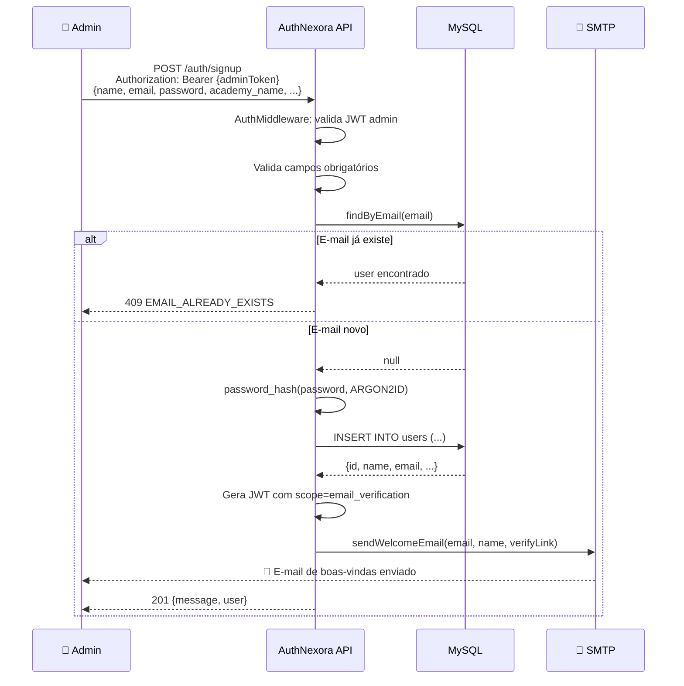
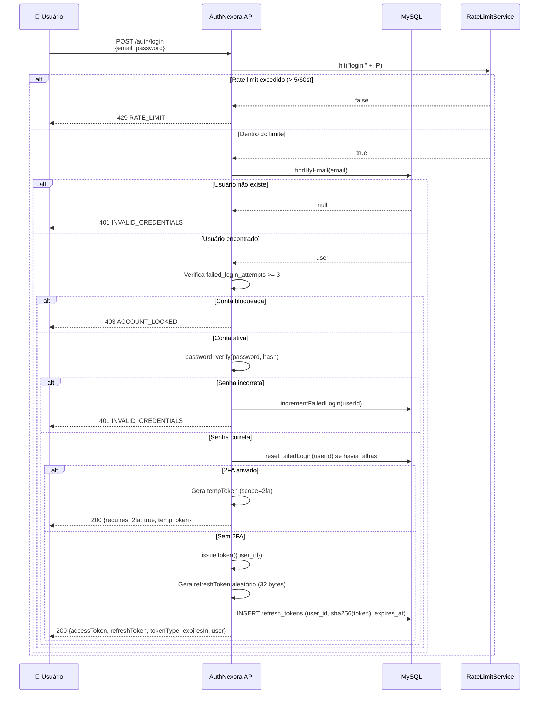
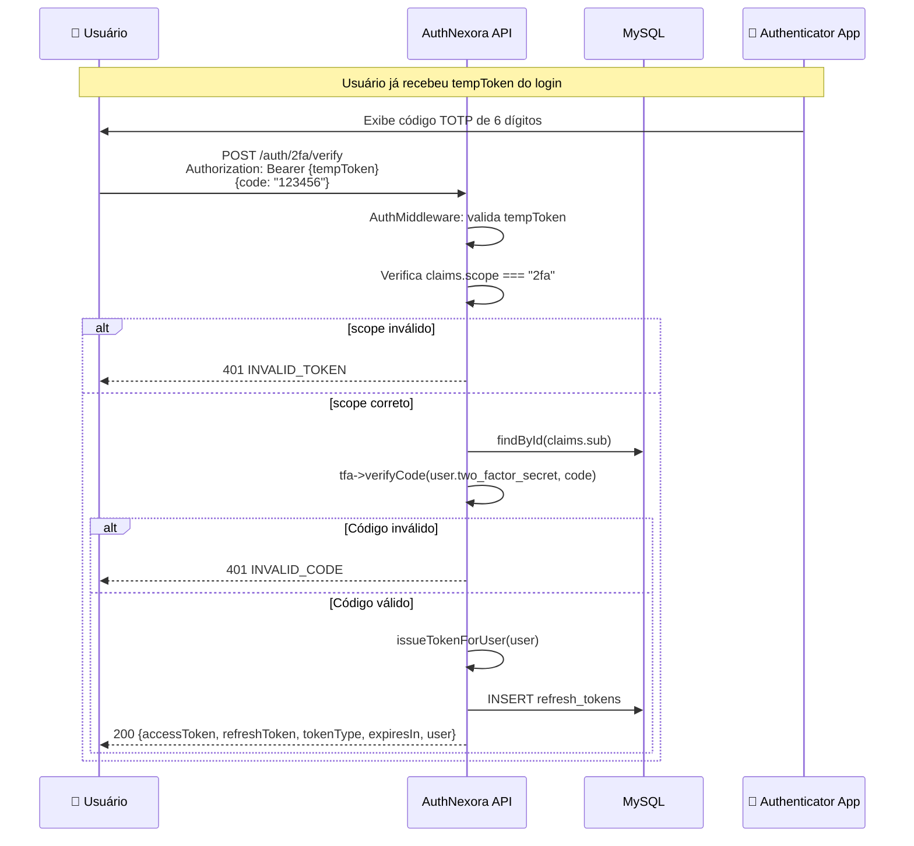
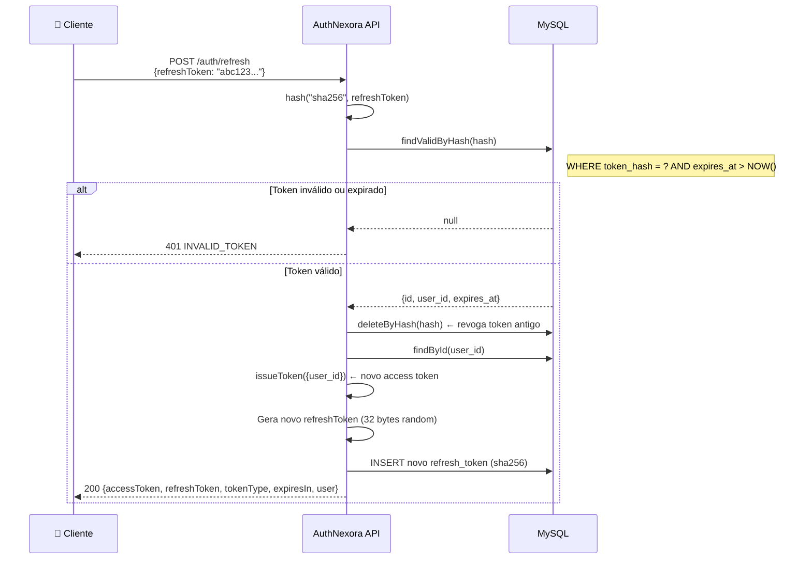
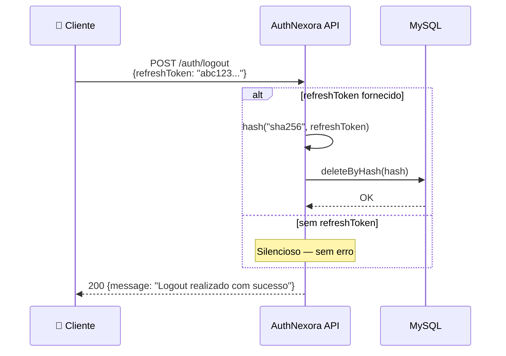
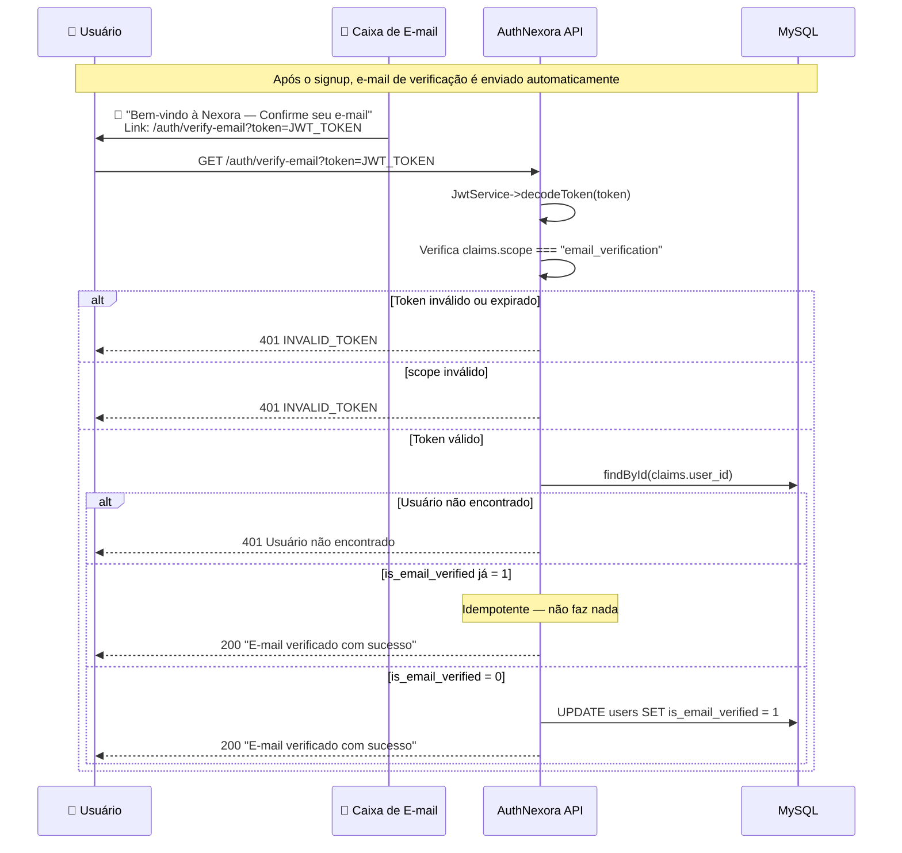
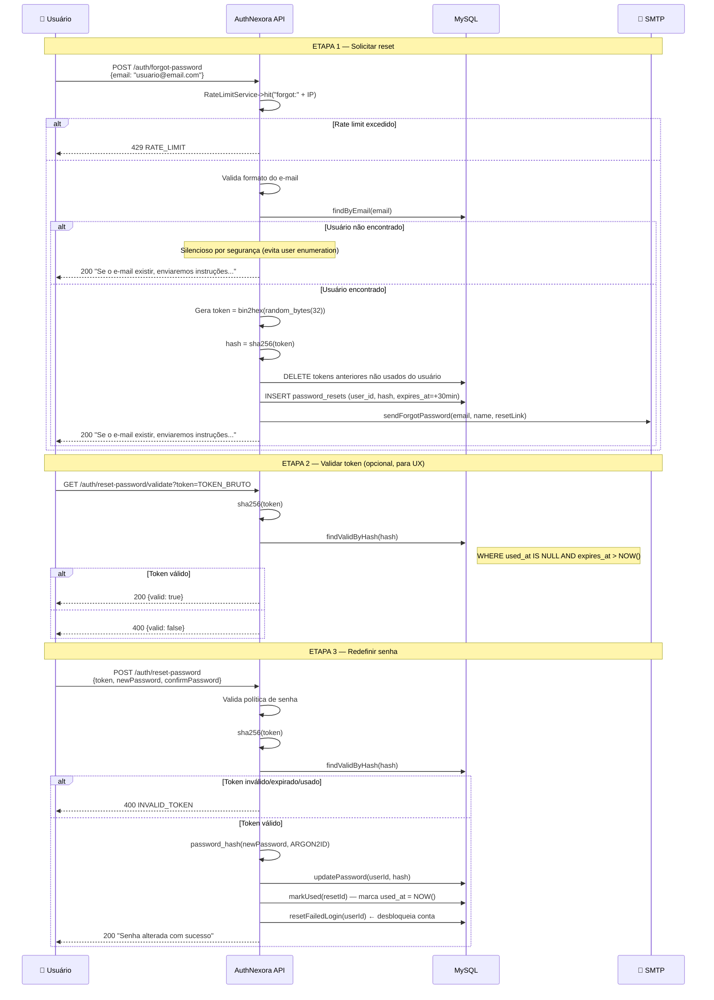
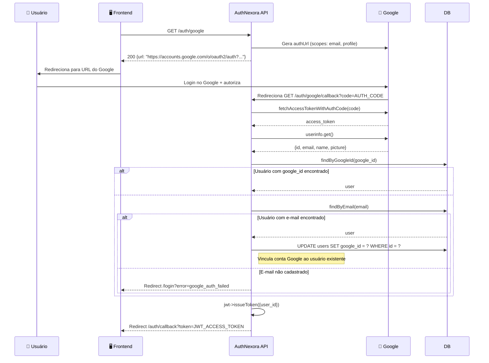
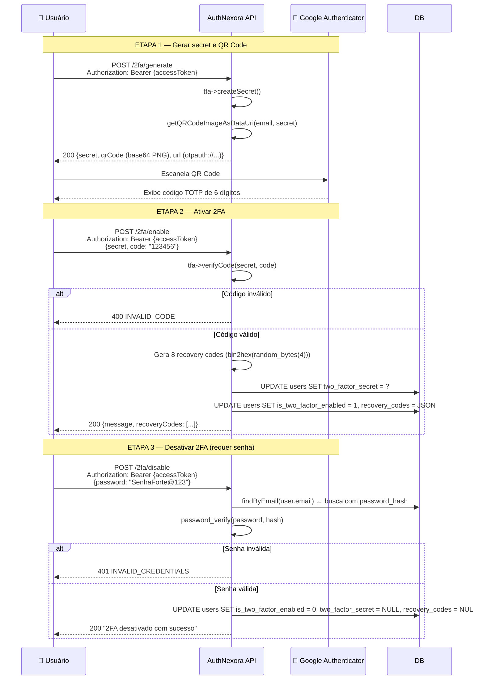

# 🔐 Autenticação — AuthNexora

> Documentação completa de todos os fluxos de autenticação suportados pelo sistema, com diagramas de sequência.

---

## Índice

1. [Registro de Usuário (Signup)](#1-registro-de-usuário-signup)
2. [Login com E-mail e Senha](#2-login-com-e-mail-e-senha)
3. [Login com 2FA (TOTP)](#3-login-com-2fa-totp)
4. [Renovação de Token (Refresh)](#4-renovação-de-token-refresh)
5. [Logout](#5-logout)
6. [Verificação de E-mail](#6-verificação-de-e-mail)
7. [Recuperação de Senha](#7-recuperação-de-senha)
8. [Autenticação via Google OAuth](#8-autenticação-via-google-oauth)
9. [Configuração de 2FA](#9-configuração-de-2fa)

---

## 1. Registro de Usuário (Signup)

> [!IMPORTANT]
> O endpoint `/auth/signup` **requer autenticação JWT**. Apenas usuários já autenticados (administradores) podem criar novos usuários. Este é um design intencional para sistemas com cadastro controlado.



### Campos obrigatórios no signup

| Campo | Validação |
|---|---|
| `name` | Mínimo 3 caracteres |
| `email` | Formato válido (`FILTER_VALIDATE_EMAIL`) |
| `academy_name` | Mínimo 2 caracteres |
| `password` | 8+ chars, maiúscula, minúscula, número e símbolo |
| `confirmPassword` | Deve ser igual a `password` |

### Campos opcionais

`phone`, `birth_date`, `gender`, `cpf`, `address`, `belt`, `degree`, `last_graduation`

---

## 2. Login com E-mail e Senha



### Resposta de login bem-sucedido (sem 2FA)

```json
{
  "accessToken": "eyJhbGciOiJIUzI1NiIsInR5cCI6IkpXVCJ9...",
  "refreshToken": "a1b2c3d4e5f6...",
  "tokenType": "Bearer",
  "expiresIn": 3600,
  "user": {
    "id": 1,
    "name": "Maria Silva",
    "email": "maria@email.com",
    "phone": "+55 11 99999-9999",
    "birth_date": "1990-05-15",
    "gender": "Feminino",
    "cpf": "123.456.789-00",
    "address": "Rua das Flores, 123",
    "belt": "Azul",
    "degree": "2º Grau",
    "last_graduation": "2023-10-01",
    "academy_name": "Gracie Barra"
  }
}
```

### Resposta quando 2FA está ativo

```json
{
  "requires_2fa": true,
  "tempToken": "eyJhbGciOiJIUzI1NiIsInR5cCI6IkpXVCJ9..."
}
```

> [!NOTE]
> O `tempToken` é um JWT com `scope: "2fa"` e TTL padrão (1h). Ele **não concede acesso** a nenhum recurso protegido além do endpoint `/auth/2fa/verify`.

---

## 3. Login com 2FA (TOTP)

Este fluxo é a **continuação do login** quando `requires_2fa: true`.



---

## 4. Renovação de Token (Refresh)

O AuthNexora implementa **Token Rotation**: a cada renovação, o refresh token antigo é revogado e um novo par é emitido.



> [!IMPORTANT]
> **Token Rotation** significa que um refresh token só pode ser usado **uma única vez**. Após uso, ele é deletado do banco. Qualquer tentativa de reutilizá-lo retornará `401 INVALID_TOKEN`.

---

## 5. Logout



> [!NOTE]
> O logout **não invalida o Access Token JWT** (que expira naturalmente em 1h). Para segurança máxima, o cliente deve descartar o access token localmente após o logout.

---

## 6. Verificação de E-mail



> [!NOTE]
> O token de verificação de e-mail é um **JWT comum** com o campo adicional `scope: "email_verification"` e `user_id`. Ele usa o mesmo TTL configurado em `JWT_EXPIRES_IN` (padrão: 1h).

---

## 7. Recuperação de Senha



> [!TIP]
> O reset de senha também **reseta o contador de tentativas falhas** (`failed_login_attempts = 0`), desbloqueando contas que foram bloqueadas por brute force.

---

## 8. Autenticação via Google OAuth



> [!WARNING]
> O fluxo OAuth emite apenas um **Access Token** (sem Refresh Token persistido no banco). O usuário precisará fazer novo login OAuth quando o token expirar.

> [!IMPORTANT]
> Novos usuários **não podem** se cadastrar via Google. Apenas usuários já cadastrados no sistema (por e-mail) podem vincular/usar a conta Google.

---

## 9. Configuração de 2FA



> [!IMPORTANT]
> Os **recovery codes** são gerados no momento da ativação e exibidos **uma única vez**. O usuário deve salvá-los em local seguro. Não há forma de recuperá-los depois.

---

## Ver também

- [authorization.md](authorization.md) — JWT, escopos e proteção de rotas
- [security.md](security.md) — Análise de segurança dos fluxos
- [api.md](api.md) — Referência completa dos endpoints
