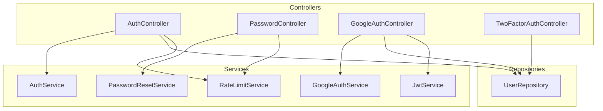

# 🎮 Controllers — AuthNexora

> Referência de todos os controllers do sistema com suas responsabilidades, métodos e dependências.

---

## Visão Geral

---

## AuthController

**Arquivo:** [`src/Controllers/AuthController.php`](../api/src/Controllers/AuthController.php)

O controller principal do sistema. Gerencia o ciclo de vida completo da autenticação de usuários.

### Dependências

| Dependência | Tipo |
|---|---|
| `AuthService` | Service |
| `UserRepository` | Repository |
| `RateLimitService` | Service |

### Métodos

#### `signup(array $claims): void`

- **Rota:** `POST /auth/signup`
- **Auth:** JWT (admin)
- **Valida:** `name` (≥3 chars), `email` (formato), `academy_name` (≥2 chars), `password` (política), `confirmPassword` (igualdade)
- **Verifica:** E-mail duplicado no banco
- **Delega:** `AuthService::signup()` para criação e envio de e-mail
- **Retorna:** `201 {message, user}`

#### `login(): void`

- **Rota:** `POST /auth/login`
- **Auth:** Pública + Rate Limit
- **Valida:** `email` e `password` presentes
- **Trata:** `ACCOUNT_LOCKED` → 403
- **Retorna:** `200 {accessToken, refreshToken, ...}` ou `{requires_2fa, tempToken}`

#### `me(array $claims): void`

- **Rota:** `GET /auth/me`
- **Auth:** JWT
- **Extrai:** `$claims['sub']` como user ID
- **Retorna:** `200` dados do usuário via `UserRepository::findById()`

#### `updateProfile(array $claims): void`

- **Rota:** `PUT /auth/me`
- **Auth:** JWT
- **Valida:** `name` obrigatório
- **Delega:** `UserRepository::update()`
- **Retorna:** `200 {message, user}`

#### `logout(): void`

- **Rota:** `POST /auth/logout`
- **Auth:** Pública
- **Delega:** `AuthService::logout(refreshToken)`
- **Retorna:** `200 {message}`

#### `refresh(): void`

- **Rota:** `POST /auth/refresh`
- **Auth:** Pública
- **Delega:** `AuthService::refreshToken()`
- **Retorna:** `200 {accessToken, refreshToken, ...}`

#### `verifyEmail(): void`

- **Rota:** `GET /auth/verify-email`
- **Auth:** Token via `?token=`
- **Decodifica:** JWT com `scope=email_verification`
- **Delega:** `UserRepository::verifyEmail()`
- **Retorna:** `200 {message}`

#### `verify2fa(array $claims): void`

- **Rota:** `POST /auth/2fa/verify`
- **Auth:** JWT (scope=2fa)
- **Verifica:** TOTP via `RobThree\Auth\TwoFactorAuth`
- **Delega:** `AuthService::issueTokenForUser()`
- **Retorna:** `200 {accessToken, refreshToken, ...}`

---

## PasswordController

**Arquivo:** [`src/Controllers/PasswordController.php`](../api/src/Controllers/PasswordController.php)

Gerencia o fluxo completo de recuperação e redefinição de senha.

### Dependências

| Dependência | Tipo |
|---|---|
| `PasswordResetService` | Service |
| `RateLimitService` | Service |

### Métodos

#### `forgotPassword(): void`

- **Rota:** `POST /auth/forgot-password`
- **Rate Limit:** `forgot:{IP}`
- **Valida:** Formato de e-mail
- **Silencioso:** Sempre retorna 200 (previne user enumeration)
- **Retorna:** `200 {message}`

#### `validateResetToken(): void`

- **Rota:** `GET /auth/reset-password/validate?token=...`
- **Retorna:** `200 {valid: true}` ou `400 {valid: false}`

#### `resetPassword(): void`

- **Rota:** `POST /auth/reset-password`
- **Valida:** `token`, `newPassword` (política), `confirmPassword` (igualdade)
- **Retorna:** `200 {message}` ou `400 INVALID_TOKEN`

---

## GoogleAuthController

**Arquivo:** [`src/Controllers/GoogleAuthController.php`](../api/src/Controllers/GoogleAuthController.php)

Gerencia o fluxo OAuth 2.0 com o Google.

### Dependências

| Dependência | Tipo |
|---|---|
| `GoogleAuthService` | Service |
| `UserRepository` | Repository |
| `JwtService` | Service |
| `$config` | array (env) |

### Métodos

#### `login(): void`

- **Rota:** `GET /auth/google`
- **Retorna:** `200 {url: "https://accounts.google.com/..."}` — URL para redirecionamento

#### `callback(): void`

- **Rota:** `GET /auth/google/callback?code=...`
- **Lógica:**
  1. Autentica com Google usando o `code`
  2. Busca usuário por `google_id`
  3. Se não encontrado, busca por `email` e vincula a conta
  4. Se e-mail não existe no sistema: rejeita
  5. Emite JWT e redireciona ao frontend

---

## TwoFactorAuthController

**Arquivo:** [`src/Controllers/TwoFactorAuthController.php`](../api/src/Controllers/TwoFactorAuthController.php)

Gerencia o ciclo de vida do 2FA: geração, ativação e desativação.

### Dependências

| Dependência | Tipo |
|---|---|
| `UserRepository` | Repository |
| `TwoFactorAuth` (RobThree) | Biblioteca |
| `ChillerlanQRCodeProvider` | Provider |

### Métodos

#### `generate(array $claims): void`

- **Rota:** `POST /2fa/generate`
- **Auth:** JWT
- **Gera:** Secret TOTP + QR Code PNG (Base64) + URL `otpauth://`
- **Retorna:** `200 {secret, qrCode, url}`

#### `enable(array $claims): void`

- **Rota:** `POST /2fa/enable`
- **Auth:** JWT
- **Valida:** `secret` + código TOTP
- **Gera:** 8 recovery codes (4 bytes hex cada)
- **Salva:** Secret e recovery codes no banco
- **Retorna:** `200 {message, recoveryCodes[]}`

#### `disable(array $claims): void`

- **Rota:** `POST /2fa/disable`
- **Auth:** JWT
- **Valida:** Senha do usuário
- **Limpa:** `two_factor_secret`, `is_two_factor_enabled`, `two_factor_recovery_codes`
- **Retorna:** `200 {message}`

---

## Ver também

- [services.md](services.md) — Services utilizados pelos controllers
- [api.md](api.md) — Referência dos endpoints
- [authentication.md](authentication.md) — Fluxos de autenticação
