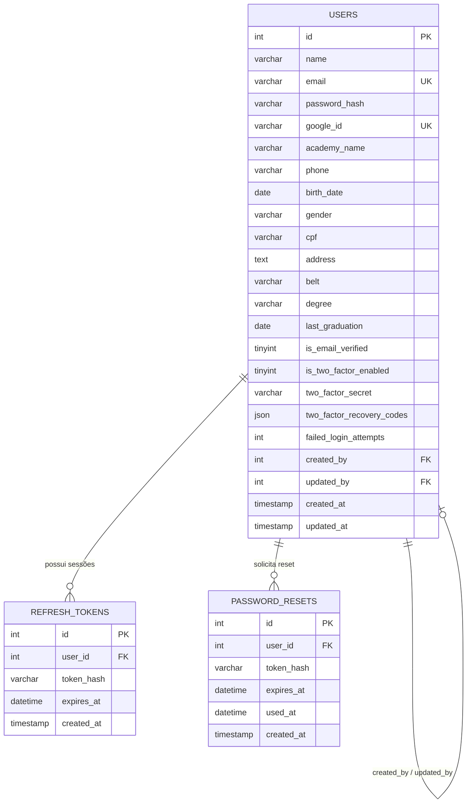

# 🗄️ Banco de Dados — AuthNexora

> Schema completo do banco de dados, diagrama ER, descrição de cada coluna e scripts SQL para criação e população inicial.

---

## Visão Geral

O AuthNexora utiliza **MySQL 8.0+** com **3 tabelas** relacionadas:



---

## Tabela: `users`

Principal tabela do sistema. Armazena todos os dados de usuário, incluindo campos específicos para academias de artes marciais.

### Schema SQL

```sql
CREATE TABLE users (
    id                      INT UNSIGNED AUTO_INCREMENT PRIMARY KEY,
    name                    VARCHAR(150)    NOT NULL,
    email                   VARCHAR(255)    NOT NULL UNIQUE,
    password_hash           VARCHAR(255)    NULL,
    google_id               VARCHAR(100)    NULL UNIQUE,
    academy_name            VARCHAR(200)    NULL,
    phone                   VARCHAR(30)     NULL,
    birth_date              DATE            NULL,
    gender                  VARCHAR(30)     NULL,
    cpf                     VARCHAR(20)     NULL,
    address                 TEXT            NULL,
    belt                    VARCHAR(50)     NULL,
    degree                  VARCHAR(50)     NULL,
    last_graduation         DATE            NULL,
    is_email_verified       TINYINT(1)      NOT NULL DEFAULT 0,
    is_two_factor_enabled   TINYINT(1)      NOT NULL DEFAULT 0,
    two_factor_secret       VARCHAR(100)    NULL,
    two_factor_recovery_codes JSON          NULL,
    failed_login_attempts   INT UNSIGNED    NOT NULL DEFAULT 0,
    created_by              INT UNSIGNED    NULL,
    updated_by              INT UNSIGNED    NULL,
    created_at              TIMESTAMP       NOT NULL DEFAULT CURRENT_TIMESTAMP,
    updated_at              TIMESTAMP       NOT NULL DEFAULT CURRENT_TIMESTAMP ON UPDATE CURRENT_TIMESTAMP,

    CONSTRAINT fk_users_created_by FOREIGN KEY (created_by) REFERENCES users(id) ON DELETE SET NULL,
    CONSTRAINT fk_users_updated_by FOREIGN KEY (updated_by) REFERENCES users(id) ON DELETE SET NULL
) ENGINE=InnoDB DEFAULT CHARSET=utf8mb4 COLLATE=utf8mb4_unicode_ci;
```

### Descrição das Colunas

| Coluna | Tipo | Nulo | Padrão | Descrição |
|---|---|---|---|---|
| `id` | INT UNSIGNED | ❌ | AUTO_INCREMENT | Identificador único |
| `name` | VARCHAR(150) | ❌ | — | Nome completo do usuário |
| `email` | VARCHAR(255) | ❌ | — | E-mail único (normalizado em lowercase) |
| `password_hash` | VARCHAR(255) | ✅ | NULL | Hash Argon2ID da senha. NULL para usuários criados via Google |
| `google_id` | VARCHAR(100) | ✅ | NULL | ID único do Google OAuth |
| `academy_name` | VARCHAR(200) | ✅ | NULL | Nome da academia de artes marciais |
| `phone` | VARCHAR(30) | ✅ | NULL | Telefone com DDD |
| `birth_date` | DATE | ✅ | NULL | Data de nascimento |
| `gender` | VARCHAR(30) | ✅ | NULL | Gênero (texto livre) |
| `cpf` | VARCHAR(20) | ✅ | NULL | CPF (texto, sem validação de formato no banco) |
| `address` | TEXT | ✅ | NULL | Endereço completo |
| `belt` | VARCHAR(50) | ✅ | NULL | Faixa (ex: Branca, Azul, Roxa, Marrom, Preta) |
| `degree` | VARCHAR(50) | ✅ | NULL | Grau da faixa (ex: 1º Grau, 4º Grau) |
| `last_graduation` | DATE | ✅ | NULL | Data da última graduação |
| `is_email_verified` | TINYINT(1) | ❌ | 0 | `1` = e-mail verificado |
| `is_two_factor_enabled` | TINYINT(1) | ❌ | 0 | `1` = 2FA ativo |
| `two_factor_secret` | VARCHAR(100) | ✅ | NULL | Chave secreta TOTP (base32). Ativa apenas se `is_two_factor_enabled = 1` |
| `two_factor_recovery_codes` | JSON | ✅ | NULL | Array JSON de 8 códigos de recuperação |
| `failed_login_attempts` | INT UNSIGNED | ❌ | 0 | Contador de tentativas falhas. Reset após senha correta ou reset de senha |
| `created_by` | INT UNSIGNED | ✅ | NULL | FK → `users.id` do admin que criou o usuário |
| `updated_by` | INT UNSIGNED | ✅ | NULL | FK → `users.id` do usuário que fez a última atualização |
| `created_at` | TIMESTAMP | ❌ | CURRENT_TIMESTAMP | Data de criação |
| `updated_at` | TIMESTAMP | ❌ | CURRENT_TIMESTAMP | Data da última atualização |

---

## Tabela: `refresh_tokens`

Armazena os hashes dos refresh tokens ativos (sessões). Utilizada para Token Rotation.

### Schema SQL

```sql
CREATE TABLE refresh_tokens (
    id          INT UNSIGNED    AUTO_INCREMENT PRIMARY KEY,
    user_id     INT UNSIGNED    NOT NULL,
    token_hash  VARCHAR(64)     NOT NULL,
    expires_at  DATETIME        NOT NULL,
    created_at  TIMESTAMP       NOT NULL DEFAULT CURRENT_TIMESTAMP,

    INDEX idx_token_hash (token_hash),
    INDEX idx_user_id (user_id),

    CONSTRAINT fk_refresh_user FOREIGN KEY (user_id) REFERENCES users(id) ON DELETE CASCADE
) ENGINE=InnoDB DEFAULT CHARSET=utf8mb4 COLLATE=utf8mb4_unicode_ci;
```

### Descrição das Colunas

| Coluna | Tipo | Descrição |
|---|---|---|
| `id` | INT UNSIGNED | Identificador único |
| `user_id` | INT UNSIGNED | FK → `users.id` |
| `token_hash` | VARCHAR(64) | SHA-256 do token bruto (hex, 64 chars) |
| `expires_at` | DATETIME | Data de expiração (padrão: +7 dias) |
| `created_at` | TIMESTAMP | Data de criação |

> [!IMPORTANT]
> O token bruto **nunca é armazenado** no banco. Apenas seu hash SHA-256 é persistido. Isso evita exposição em caso de vazamento do banco.

### Lógica de Token Rotation

```
1. Login → gera token = bin2hex(random_bytes(32))
2. Banco recebe → hash = sha256(token) → INSERT
3. Refresh → SELECT WHERE token_hash = sha256(refreshToken) AND expires_at > NOW()
4. Rotate → DELETE token antigo → INSERT novo token
```

---

## Tabela: `password_resets`

Gerencia os tokens de recuperação de senha com TTL de 30 minutos.

### Schema SQL

```sql
CREATE TABLE password_resets (
    id          INT UNSIGNED    AUTO_INCREMENT PRIMARY KEY,
    user_id     INT UNSIGNED    NOT NULL,
    token_hash  VARCHAR(64)     NOT NULL,
    expires_at  DATETIME        NOT NULL,
    used_at     DATETIME        NULL,
    created_at  TIMESTAMP       NOT NULL DEFAULT CURRENT_TIMESTAMP,

    INDEX idx_token_hash (token_hash),
    INDEX idx_user_id (user_id),

    CONSTRAINT fk_reset_user FOREIGN KEY (user_id) REFERENCES users(id) ON DELETE CASCADE
) ENGINE=InnoDB DEFAULT CHARSET=utf8mb4 COLLATE=utf8mb4_unicode_ci;
```

### Descrição das Colunas

| Coluna | Tipo | Descrição |
|---|---|---|
| `id` | INT UNSIGNED | Identificador único |
| `user_id` | INT UNSIGNED | FK → `users.id` |
| `token_hash` | VARCHAR(64) | SHA-256 do token bruto |
| `expires_at` | DATETIME | Expiração (padrão: +30 minutos) |
| `used_at` | DATETIME | NULL = não usado. Preenchido quando o reset é concluído |
| `created_at` | TIMESTAMP | Data de criação |

### Comportamento de Segurança

1. **Um token por vez:** Ao solicitar novo reset, todos os tokens anteriores não usados do usuário são **deletados**
2. **Token single-use:** Após uso, `used_at` é preenchido e o token não pode ser reusado
3. **TTL automático:** Tokens com `expires_at < NOW()` são ignorados na busca

---

## Script SQL Completo

```sql
-- ================================================================
-- AuthNexora — Schema Inicial
-- Versão: 1.0
-- Charset: utf8mb4 / Collate: utf8mb4_unicode_ci
-- ================================================================

CREATE DATABASE IF NOT EXISTS authnexora
    DEFAULT CHARACTER SET utf8mb4
    DEFAULT COLLATE utf8mb4_unicode_ci;

USE authnexora;

-- ── Tabela de usuários ──────────────────────────────────────────
CREATE TABLE IF NOT EXISTS users (
    id                      INT UNSIGNED AUTO_INCREMENT PRIMARY KEY,
    name                    VARCHAR(150)    NOT NULL,
    email                   VARCHAR(255)    NOT NULL UNIQUE,
    password_hash           VARCHAR(255)    NULL,
    google_id               VARCHAR(100)    NULL UNIQUE,
    academy_name            VARCHAR(200)    NULL,
    phone                   VARCHAR(30)     NULL,
    birth_date              DATE            NULL,
    gender                  VARCHAR(30)     NULL,
    cpf                     VARCHAR(20)     NULL,
    address                 TEXT            NULL,
    belt                    VARCHAR(50)     NULL,
    degree                  VARCHAR(50)     NULL,
    last_graduation         DATE            NULL,
    is_email_verified       TINYINT(1)      NOT NULL DEFAULT 0,
    is_two_factor_enabled   TINYINT(1)      NOT NULL DEFAULT 0,
    two_factor_secret       VARCHAR(100)    NULL,
    two_factor_recovery_codes JSON          NULL,
    failed_login_attempts   INT UNSIGNED    NOT NULL DEFAULT 0,
    created_by              INT UNSIGNED    NULL,
    updated_by              INT UNSIGNED    NULL,
    created_at              TIMESTAMP       NOT NULL DEFAULT CURRENT_TIMESTAMP,
    updated_at              TIMESTAMP       NOT NULL DEFAULT CURRENT_TIMESTAMP ON UPDATE CURRENT_TIMESTAMP,

    CONSTRAINT fk_users_created_by FOREIGN KEY (created_by) REFERENCES users(id) ON DELETE SET NULL,
    CONSTRAINT fk_users_updated_by FOREIGN KEY (updated_by) REFERENCES users(id) ON DELETE SET NULL
) ENGINE=InnoDB DEFAULT CHARSET=utf8mb4 COLLATE=utf8mb4_unicode_ci;

-- ── Tabela de refresh tokens ────────────────────────────────────
CREATE TABLE IF NOT EXISTS refresh_tokens (
    id          INT UNSIGNED    AUTO_INCREMENT PRIMARY KEY,
    user_id     INT UNSIGNED    NOT NULL,
    token_hash  VARCHAR(64)     NOT NULL,
    expires_at  DATETIME        NOT NULL,
    created_at  TIMESTAMP       NOT NULL DEFAULT CURRENT_TIMESTAMP,

    INDEX idx_refresh_token_hash (token_hash),
    INDEX idx_refresh_user_id (user_id),

    CONSTRAINT fk_refresh_user FOREIGN KEY (user_id) REFERENCES users(id) ON DELETE CASCADE
) ENGINE=InnoDB DEFAULT CHARSET=utf8mb4 COLLATE=utf8mb4_unicode_ci;

-- ── Tabela de reset de senha ────────────────────────────────────
CREATE TABLE IF NOT EXISTS password_resets (
    id          INT UNSIGNED    AUTO_INCREMENT PRIMARY KEY,
    user_id     INT UNSIGNED    NOT NULL,
    token_hash  VARCHAR(64)     NOT NULL,
    expires_at  DATETIME        NOT NULL,
    used_at     DATETIME        NULL,
    created_at  TIMESTAMP       NOT NULL DEFAULT CURRENT_TIMESTAMP,

    INDEX idx_reset_token_hash (token_hash),
    INDEX idx_reset_user_id (user_id),

    CONSTRAINT fk_reset_user FOREIGN KEY (user_id) REFERENCES users(id) ON DELETE CASCADE
) ENGINE=InnoDB DEFAULT CHARSET=utf8mb4 COLLATE=utf8mb4_unicode_ci;
```

---

## Seed — Usuário Administrador Inicial

```sql
-- ================================================================
-- AuthNexora — Seed: Usuário Admin
-- Senha: Admin@Nexora123  (Argon2ID hash)
-- ================================================================

INSERT INTO users (
    name,
    email,
    password_hash,
    academy_name,
    is_email_verified,
    created_at
) VALUES (
    'Administrador Nexora',
    'admin@nexora.com',
    -- Gere o hash com: password_hash('Admin@Nexora123', PASSWORD_ARGON2ID)
    '$argon2id$v=19$m=65536,t=4,p=1$...',
    'Nexora HQ',
    1,
    NOW()
);
```

> [!CAUTION]
> O hash acima é apenas um placeholder. Gere o hash real executando:
> ```php
> echo password_hash('SuaSenhaSegura@123', PASSWORD_ARGON2ID);
> ```

---

## Configuração da Conexão

O sistema usa um **Singleton PDO** configurado em `src/Config/Database.php`:

```php
$dsn = sprintf(
    'mysql:host=%s;port=%s;dbname=%s;charset=%s',
    $db['host'], $db['port'], $db['database'], 'utf8mb4'
);

new PDO($dsn, $username, $password, [
    PDO::ATTR_ERRMODE            => PDO::ERRMODE_EXCEPTION,
    PDO::ATTR_DEFAULT_FETCH_MODE => PDO::FETCH_ASSOC,
]);
```

---

## Ver também

- [environment.md](environment.md) — Variáveis de conexão com o banco
- [repositories.md](repositories.md) — Queries SQL utilizadas
- [security.md](security.md) — Proteção contra SQL Injection
