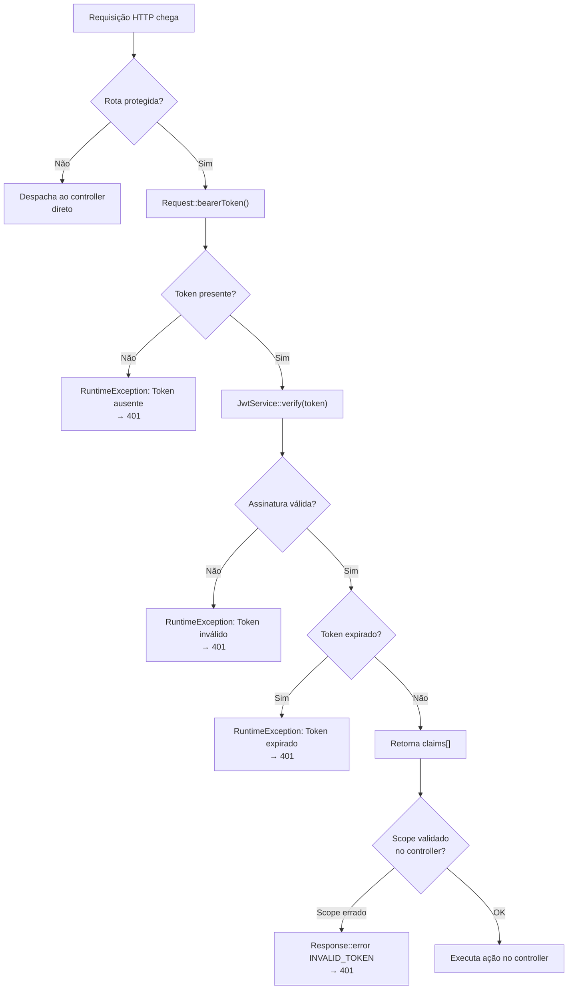

# 🧩 Middleware — AuthNexora

> Documentação do `AuthMiddleware` e do mecanismo de validação de escopos JWT.

---

## AuthMiddleware

**Arquivo:** [`src/Middleware/AuthMiddleware.php`](../api/src/Middleware/AuthMiddleware.php)

O único middleware do sistema. Responsável por proteger rotas que exigem autenticação JWT.

```php
final class AuthMiddleware
{
    public function __construct(private readonly JwtService $jwt) {}

    public function authenticate(?string $token): array
    {
        if (!$token) {
            throw new RuntimeException('Token ausente');
        }
        return $this->jwt->verify($token);
    }
}
```

### Responsabilidades

- Verificar se o Bearer Token está presente na requisição
- Delegar a verificação criptográfica ao `JwtService`
- Retornar o array de `claims` para o controller

### Como é invocado

No `index.php`, o middleware é chamado **antes** do despacho ao controller:

```php
// Rota protegida
} elseif ($method === 'GET' && $path === '/auth/me') {
    $claims = $authMiddleware->authenticate(Request::bearerToken()); // ← aqui
    $authController->me($claims);
```

### Comportamento em erro

O middleware lança `RuntimeException` que é capturada pelo bloco global no `index.php`:

```php
catch (Throwable $e) {
    if (in_array($e->getMessage(), ['Token ausente', 'Token inválido', 'Token expirado'])) {
        $status = 401;
    }
    Response::error('UNAUTHORIZED', $e->getMessage(), [], $status);
}
```

---

## Extração do Bearer Token

**Arquivo:** [`src/Helpers/Request.php`](../api/src/Helpers/Request.php)

```php
public static function bearerToken(): ?string
{
    $auth = $_SERVER['HTTP_AUTHORIZATION'] ?? '';
    if (preg_match('/Bearer\s+(.*)$/i', $auth, $matches) !== 1) {
        return null;
    }
    return trim($matches[1]);
}
```

O token é extraído do header `Authorization: Bearer {token}`.

---

## Validação de Escopos

A validação de escopos não é feita no middleware — é feita nos **controllers**:

```php
// AuthController::verify2fa()
if (($claims['scope'] ?? '') !== '2fa') {
    Response::error('INVALID_TOKEN', 'Token inválido para esta operação', [], 401);
    return;
}

// AuthController::verifyEmail()
if (($claims['scope'] ?? '') !== 'email_verification') {
    throw new \RuntimeException('Token inválido');
}
```

> [!NOTE]
> Para ampliar o sistema, a validação de escopos poderia ser movida para o middleware, aceitando um parâmetro `$requiredScope`. Isso tornaria o código mais reutilizável.

---

## Diagrama de Fluxo



---

## Ver também

- [authorization.md](authorization.md) — JWT, escopos e classificação de rotas
- [security.md](security.md) — Segurança do JWT
