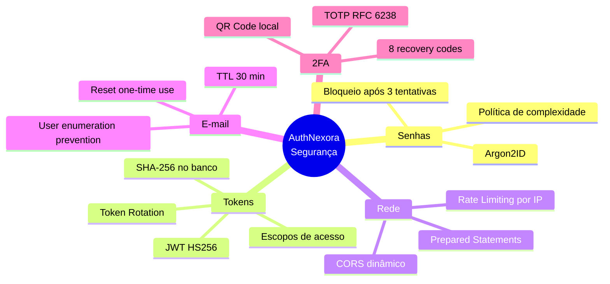
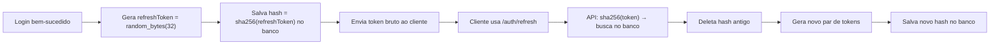

# 🔒 Segurança — AuthNexora

> Análise completa de segurança da API: mecanismos implementados, configurações recomendadas, vulnerabilidades conhecidas e boas práticas.

---

## Visão Geral de Segurança



---

## 1. Hash de Senhas — Argon2ID

O AuthNexora usa **Argon2ID**, o algoritmo mais seguro disponível no PHP nativamente, vencedor da Password Hashing Competition (2015).

```php
// Signup / Reset de senha
$hash = password_hash($password, PASSWORD_ARGON2ID);

// Verificação
$ok = password_verify($password, $storedHash);
```

### Política de Senha

A política é aplicada via regex na camada de validação:

```
/^(?=.*[a-z])(?=.*[A-Z])(?=.*\d)(?=.*[^\w\s]).{8,}$/
```

| Requisito | Mínimo |
|---|---|
| Comprimento | 8 caracteres |
| Letras minúsculas | 1 |
| Letras maiúsculas | 1 |
| Dígitos | 1 |
| Caractere especial | 1 (não alfanumérico) |

**Exemplos válidos:** `SenhaForte@123`, `N3xora!Auth`, `Jiu-Jitsu#2025`

---

## 2. JSON Web Tokens (JWT)

### Algoritmo: HS256 (HMAC-SHA256)

```
Signature = HMAC-SHA256(base64url(header) + "." + base64url(payload), JWT_SECRET)
```

### Implementação resistente a timing attacks

```php
// Comparação segura — não vaza tempo de execução
if (!hash_equals($expectedSignature, $receivedSignature)) {
    throw new RuntimeException('Token inválido');
}
```

### TTL e Escopos

| Token | TTL | Escopo | Renovável |
|---|---|---|---|
| Access Token | 1h (configurável) | — | Via Refresh Token |
| Temp Token (2FA) | 1h | `2fa` | Não |
| Verify Token (e-mail) | 1h | `email_verification` | Não |
| Refresh Token | 7 dias | N/A (banco) | Token Rotation |

### Recomendações

> [!IMPORTANT]
> **JWT_SECRET** deve ter pelo menos 32 caracteres aleatórios em produção:
> ```bash
> php -r "echo bin2hex(random_bytes(32));"
> ```

> [!WARNING]
> O Access Token **não pode ser revogado** antes de expirar. Mantenha `JWT_EXPIRES_IN` curto (900–3600 segundos) para minimizar a janela de exposição.

---

## 3. Refresh Token — Token Rotation



**Vantagens:**
- O banco nunca armazena o token bruto
- Token roubado após uso fica inválido automaticamente
- Possível detectar uso duplo (token rotation attack)

---

## 4. Bloqueio de Conta

Após **3 tentativas de login consecutivas com senha errada**, a conta é bloqueada:

```php
if ($user['failed_login_attempts'] >= 3) {
    throw new RuntimeException('ACCOUNT_LOCKED');  // HTTP 403
}
```

**Como desbloquear:** O usuário deve realizar o **reset de senha**, que também zera o contador:
```php
// Em PasswordResetService::reset()
$this->users->resetFailedLogin($userId);
```

| Evento | Efeito no contador |
|---|---|
| Senha incorreta | +1 |
| Senha correta | Reset para 0 |
| Reset de senha concluído | Reset para 0 |
| Conta bloqueada | Bloqueia ao atingir 3 |

---

## 5. Rate Limiting

O sistema implementa rate limiting por **IP + endpoint** via arquivos JSON:

| Endpoint | Chave | Limite Padrão |
|---|---|---|
| `POST /auth/login` | `login:{IP}` | 5 req / 60s |
| `POST /auth/forgot-password` | `forgot:{IP}` | 5 req / 60s |

```php
// RateLimitService — armazenamento em /storage/rate_limit/{sha1(key)}.json
{
  "count": 3,
  "started_at": 1721260800
}
```

> [!WARNING]
> **Limitação:** O Rate Limiter usa o sistema de arquivos local. Em ambientes com **múltiplos servidores** (load balancer), cada servidor terá seu próprio contador separado, tornando o rate limit ineficaz. Solução recomendada: migrar para Redis.

---

## 6. Proteção contra SQL Injection

**100% das queries** usam **PDO Prepared Statements**:

```php
// ✅ Seguro — parâmetros sempre vinculados
$stmt = $this->pdo->prepare('SELECT * FROM users WHERE email = :email LIMIT 1');
$stmt->execute(['email' => mb_strtolower($email)]);

// ❌ NUNCA faça isso (não existe no projeto)
$pdo->query("SELECT * FROM users WHERE email = '$email'");
```

---

## 7. Recuperação de Senha — Segurança

### Prevenção de User Enumeration

O endpoint `/auth/forgot-password` **sempre retorna o mesmo 200 OK**, independente de o e-mail existir:

```php
// Em PasswordResetService::request()
if (!$user) {
    return; // Silencioso — não expõe se o e-mail existe
}
```

Resposta pública: *"Se o e-mail existir, enviaremos instruções..."*

### Token one-time use

```php
// Em PasswordResetRepository::markUsed()
UPDATE password_resets SET used_at = NOW() WHERE id = :id
```

Um token usado tem `used_at NOT NULL` e é excluído da busca:
```sql
WHERE used_at IS NULL AND expires_at > NOW()
```

### Invalidação automática

Ao solicitar novo reset, todos os tokens anteriores não usados são deletados:
```php
DELETE FROM password_resets WHERE user_id = :user_id AND used_at IS NULL
```

---

## 8. CORS

O CORS é configurado dinamicamente no `index.php`:

```php
$requestOrigin = $_SERVER['HTTP_ORIGIN'] ?? '';

if ($requestOrigin !== '') {
    header("Access-Control-Allow-Origin: {$requestOrigin}");
    header('Vary: Origin');
} else {
    header("Access-Control-Allow-Origin: *");
}
```

> [!WARNING]
> O CORS atual **não valida a origem contra uma lista branca**. Aceita qualquer `Origin` enviado pelo cliente. Para produção, adicione validação:
> ```php
> $allowedOrigins = $env['app']['cors_allowed_origins'];
> if (in_array($requestOrigin, $allowedOrigins)) {
>     header("Access-Control-Allow-Origin: {$requestOrigin}");
> }
> ```

---

## 9. Autenticação de Dois Fatores (2FA)

O 2FA é implementado usando o protocolo **TOTP (RFC 6238)** via `robthree/twofactorauth`.

| Aspecto | Detalhe |
|---|---|
| Algoritmo | TOTP — SHA1, código de 6 dígitos, janela de 30s |
| QR Code | Gerado localmente (chillerlan/php-qrcode) — sem terceiros |
| Secret | Armazenado em `users.two_factor_secret` |
| Recovery Codes | 8 códigos de 4 bytes (hex) — single use |
| Desativação | Requer confirmação de senha |

---

## 10. Known Issues e Limitações

> [!WARNING]
> Os itens abaixo são **comportamentos documentados** para conhecimento. Não são bugs críticos no contexto atual de uso.

### 🔴 Alta Prioridade (para produção)

| # | Problema | Impacto | Solução Recomendada |
|---|---|---|---|
| 1 | CORS sem whitelist | Qualquer origem pode fazer requisições | Adicionar validação de `cors_allowed_origins` |
| 2 | `public/info.php` exposto | Exposição de detalhes do servidor | Deletar em produção |
| 3 | JWT sem biblioteca auditada | Implementação própria, não testada por terceiros | Migrar para `firebase/php-jwt` |

### 🟡 Média Prioridade

| # | Problema | Impacto | Solução Recomendada |
|---|---|---|---|
| 4 | Rate Limit em arquivo | Não escala horizontalmente | Migrar para Redis |
| 5 | Access Token não revogável | Janela de 1h após logout | Manter TTL curto (≤ 1h) |
| 6 | Sem HTTPS forçado | Dados em claro em HTTP | Configurar HTTPS no servidor/proxy |

### 🟢 Baixa Prioridade

| # | Problema | Impacto | Solução Recomendada |
|---|---|---|---|
| 7 | `verifyEmail` instancia JwtService inline | Acoplamento desnecessário | Injetar via construtor |
| 8 | Google OAuth sem Refresh Token | Sem sessão persistente via OAuth | Salvar sessão OAuth também |
| 9 | Recovery codes sem hash | Armazenados em texto plano no JSON | Hash dos códigos de recuperação |

---

## 11. Checklist de Segurança para Produção

- [ ] Trocar `JWT_SECRET` por valor aleatório de 32+ caracteres
- [ ] Definir `JWT_EXPIRES_IN` ≤ 3600 segundos
- [ ] Remover `api/public/info.php`
- [ ] Configurar HTTPS no servidor / proxy reverso
- [ ] Adicionar validação de lista branca para CORS
- [ ] Usar senha de app (não senha principal) para SMTP Gmail
- [ ] Configurar `display_errors = Off` no PHP de produção
- [ ] Remover `error_reporting(E_ALL)` do `index.php`
- [ ] Garantir que `api/.env` **não está** no repositório
- [ ] Configurar backup automático do banco de dados

---

## Ver também

- [authentication.md](authentication.md) — Fluxos de autenticação
- [authorization.md](authorization.md) — JWT e escopos
- [environment.md](environment.md) — Configuração de `JWT_SECRET`
