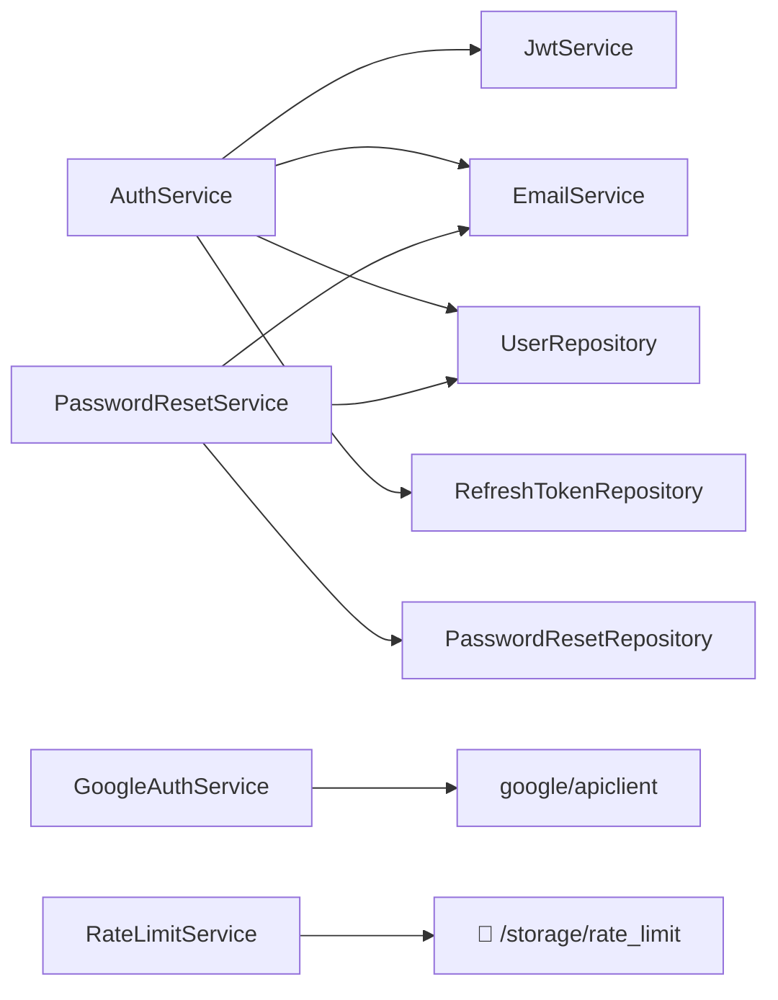

# ⚙️ Services — AuthNexora

> Referência completa dos 6 services do sistema, suas responsabilidades, dependências e métodos.

---

## Visão Geral

Os services encapsulam toda a **lógica de negócio**. Eles são instanciados com suas dependências no `index.php` e injetados nos controllers.



---

## AuthService

**Arquivo:** [`src/Services/AuthService.php`](../api/src/Services/AuthService.php)

O service orquestrador central. Gerencia signup, login, refresh e logout.

### Dependências

| Dependência | Função |
|---|---|
| `UserRepository` | CRUD de usuários |
| `JwtService` | Emissão de tokens JWT |
| `EmailService` | Envio de e-mails |
| `array $env` | Configurações (TTLs, URLs) |
| `RefreshTokenRepository` | Persistência de sessões |

### Métodos

#### `signup(array $data, ?int $createdBy): array`

1. Gera hash Argon2ID da senha
2. Cria o usuário via `UserRepository::create()`
3. Emite JWT com `scope=email_verification`
4. Envia e-mail de boas-vindas com link de verificação
5. Retorna os dados do usuário criado

#### `login(string $email, string $password): ?array`

1. Busca usuário por e-mail
2. Verifica `failed_login_attempts >= 3` → lança `ACCOUNT_LOCKED`
3. Verifica senha com `password_verify()`
4. Reseta contador se havia falhas
5. Se `is_two_factor_enabled`: emite `tempToken` (scope=2fa) → retorna `{requires_2fa, tempToken}`
6. Caso contrário: chama `issueTokenForUser()`

#### `issueTokenForUser(array $user): array`

1. Emite Access Token JWT (`user_id` no payload)
2. Gera Refresh Token (`bin2hex(random_bytes(32))`)
3. Salva hash SHA-256 do Refresh Token no banco (TTL: 7 dias)
4. Retorna `{accessToken, refreshToken, tokenType, expiresIn, user}`

#### `refreshToken(string $token): array`

1. Calcula `sha256(token)` e busca no banco
2. Se não encontrado/expirado → `RuntimeException`
3. Revoga o token antigo (`deleteByHash`)
4. Busca o usuário e chama `issueTokenForUser()`

#### `logout(?string $refreshToken): void`

1. Se `refreshToken` fornecido: calcula hash e deleta do banco
2. Silencioso — sem erro mesmo se token não existir

---

## JwtService

**Arquivo:** [`src/Services/JwtService.php`](../api/src/Services/JwtService.php)

Implementação própria de JWT com algoritmo HS256.

### Dependências

| Parâmetro | Tipo | Descrição |
|---|---|---|
| `$secret` | string | Chave HMAC (`JWT_SECRET`) |
| `$issuer` | string | Claim `iss` |
| `$expiresIn` | int | TTL em segundos |

### Métodos

#### `issueToken(array $payload): string`

Gera um JWT com claims padrão (`iss`, `iat`, `exp`, `sub`) + claims adicionais do payload.

```php
// Converte user_id → sub (string)
$claims = array_merge([
    'iss' => $this->issuer,
    'iat' => time(),
    'exp' => time() + $this->expiresIn,
    'sub' => (string) $payload['user_id'],
], $payload);
unset($claims['user_id']);
```

#### `verify(string $token): array`

1. Extrai `{header}.{payload}.{signature}`
2. Recalcula assinatura com HMAC-SHA256
3. Compara com `hash_equals()` (resistente a timing attacks)
4. Verifica expiração (`exp < time()`)
5. Retorna o array de claims

#### `decodeToken(string $token): array`

> [!NOTE]
> Alias para `verify()`. Usado em `AuthController::verifyEmail()`.

---

## EmailService

**Arquivo:** [`src/Services/EmailService.php`](../api/src/Services/EmailService.php)

Gerencia o envio de e-mails transacionais via PHPMailer (SMTP/SSL).

### Métodos

#### `sendWelcomeEmail(string $toEmail, string $toName, string $verifyLink, string $templatePath): void`

- **Template:** `templates/welcome_email.html`
- **Variáveis substituídas:** `{{name}}`, `{{verify_link}}`
- **Assunto:** "Bem-vindo à Nexora - Confirme seu e-mail"
- **Falha silenciosa:** Exceções SMTP são capturadas e ignoradas (sem expor detalhes)

#### `sendForgotPassword(string $toEmail, string $toName, string $resetLink, string $templatePath): void`

- **Template:** `templates/forgot_password_email.html`
- **Variáveis substituídas:** `{{name}}`, `{{reset_link}}`
- **Assunto:** "Redefinição de senha"
- **Falha silenciosa:** Idem

> [!WARNING]
> Falhas no envio de e-mail são **silenciosas por design**. Isso evita exposição de credenciais SMTP nos logs, mas dificulta o diagnóstico de problemas. Em produção, considere adicionar logging de erros.

---

## GoogleAuthService

**Arquivo:** [`src/Services/GoogleAuthService.php`](../api/src/Services/GoogleAuthService.php)

Abstrai a comunicação com a API do Google OAuth 2.0.

### Métodos

#### `getAuthUrl(): string`

Retorna a URL de redirecionamento do Google com `scopes` de `email` e `profile`.

#### `authenticate(string $code): array`

1. Troca o `code` por um access token (`fetchAccessTokenWithAuthCode`)
2. Obtém informações do usuário via `Oauth2::userinfo->get()`
3. Retorna `{google_id, email, name, picture}`

---

## PasswordResetService

**Arquivo:** [`src/Services/PasswordResetService.php`](../api/src/Services/PasswordResetService.php)

Gerencia o fluxo de recuperação de senha com tokens seguros.

### Métodos

#### `request(string $email): void`

1. Busca usuário (silencioso se não encontrar)
2. Gera `token = bin2hex(random_bytes(32))` + `hash = sha256(token)`
3. Invalida tokens anteriores não usados
4. Insere novo token com TTL de 30 minutos
5. Envia e-mail com link de reset

#### `validate(string $token): bool`

Verifica se o token (bruto) tem um hash correspondente válido e não expirado.

#### `reset(string $token, string $newPassword): bool`

1. Valida o token
2. Atualiza a senha com Argon2ID
3. Marca o token como usado (`used_at = NOW()`)
4. Reseta `failed_login_attempts` (desbloqueia a conta)
5. Retorna `true` em caso de sucesso

---

## RateLimitService

**Arquivo:** [`src/Services/RateLimitService.php`](../api/src/Services/RateLimitService.php)

Limita o número de requisições por chave (IP + endpoint) em uma janela de tempo.

### Mecanismo

Armazena contadores em arquivos JSON em `storage/rate_limit/`:
- Nome do arquivo: `sha1(key)` (ex: `sha1("login:192.168.1.1")`)
- Conteúdo: `{"count": 3, "started_at": 1721260800}`

### Métodos

#### `hit(string $key): bool`

1. Lê o arquivo JSON da chave
2. Se a janela expirou: reseta o contador
3. Incrementa o contador
4. Retorna `true` se `count <= maxAttempts`, `false` se excedeu

```php
$rateLimit = new RateLimitService(
    maxAttempts: 5,
    windowSeconds: 60
);

if (!$rateLimit->hit('login:' . $ip)) {
    // Limite excedido → HTTP 429
}
```

---

## Ver também

- [controllers.md](controllers.md) — Como os services são usados pelos controllers
- [repositories.md](repositories.md) — Acesso a dados pelos services
- [security.md](security.md) — Segurança dos algoritmos usados
