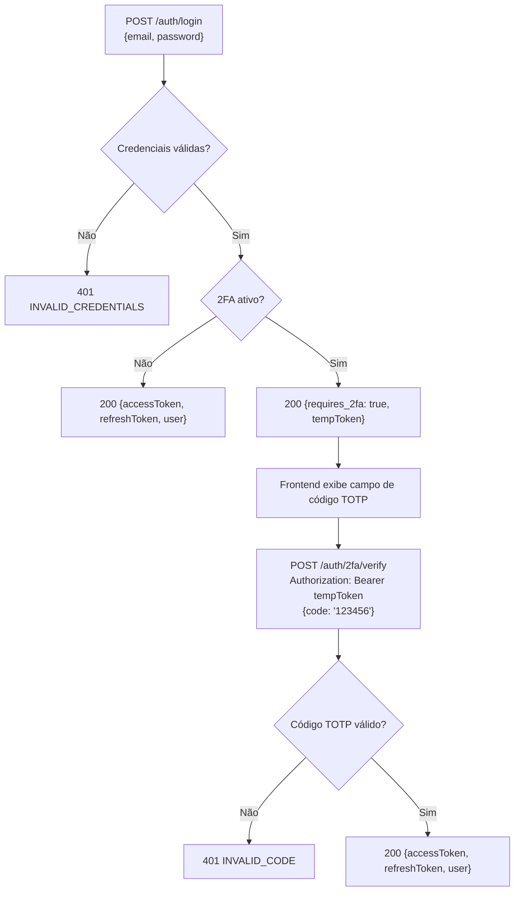
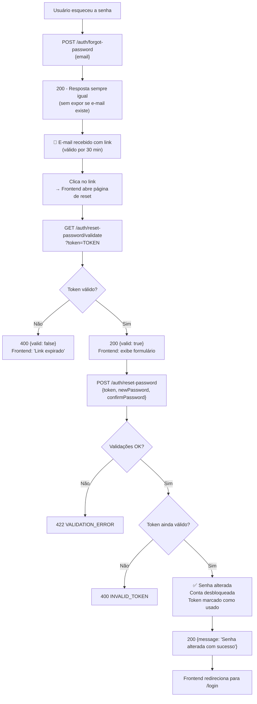
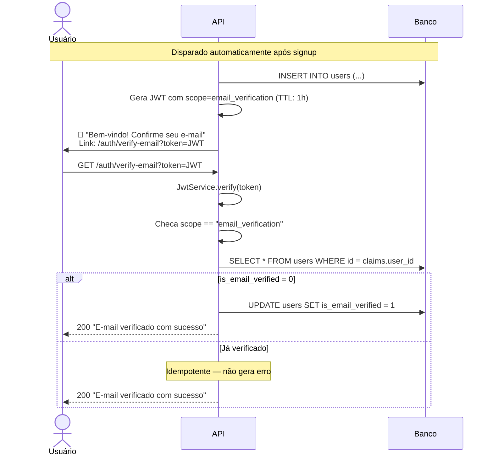
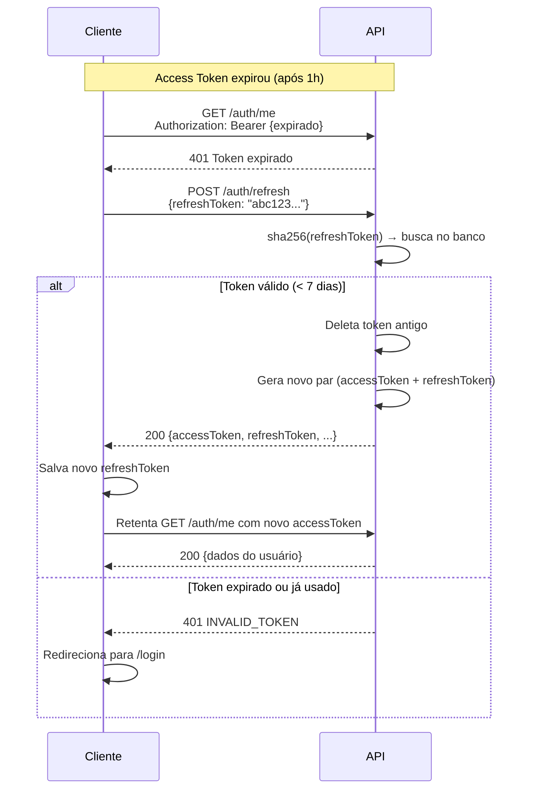

# 🔄 Workflows — AuthNexora

> Documentação detalhada de workflows completos: configuração de 2FA, reset de senha e verificação de e-mail.

---

## Workflow 1 — Configuração de 2FA do Zero

Este workflow descreve todos os passos necessários para um usuário configurar a autenticação de dois fatores.

```mermaid
sequenceDiagram
    actor U as Usuário
    participant FE as Frontend
    participant API as API
    participant APP as 📱 Authenticator

    Note over U,APP: PRÉ-REQUISITO: Usuário logado com accessToken válido

    U->>FE: Clica em "Ativar 2FA"

    rect rgb(20, 40, 60)
        Note over FE,API: ETAPA 1 — Gerar Secret
        FE->>API: POST /2fa/generate<br/>Auth: Bearer {accessToken}
        API-->>FE: {secret, qrCode (base64), url}
        FE->>U: Exibe QR Code na tela
    end

    rect rgb(20, 60, 40)
        Note over U,APP: ETAPA 2 — Escanear QR Code
        U->>APP: Escaneia QR Code
        APP-->>U: Exibe código TOTP (renova a cada 30s)
    end

    rect rgb(60, 40, 20)
        Note over U,API: ETAPA 3 — Confirmar e Ativar
        U->>FE: Digita código TOTP de 6 dígitos
        FE->>API: POST /2fa/enable<br/>{secret, code: "123456"}
        API->>API: Verifica TOTP
        alt Código correto
            API->>API: Gera 8 recovery codes
            API-->>FE: 200 {message, recoveryCodes[]}
            FE->>U: ⚠️ Exibe recovery codes (UMA VEZ APENAS)
            U->>U: Salva recovery codes em local seguro
        else Código errado
            API-->>FE: 400 INVALID_CODE
            FE->>U: "Código inválido, tente novamente"
        end
    end
```

### Checklist do Frontend

- [ ] Exibir QR Code como ``
- [ ] Dar opção de copiar o `secret` manualmente (para quem não consegue escanear)
- [ ] Após ativação, exibir os 8 recovery codes com destaque visual
- [ ] Incluir botão "Copiar todos os códigos" ou "Baixar como .txt"
- [ ] Confirmar que o usuário salvou os códigos antes de fechar o modal

---

## Workflow 2 — Login com 2FA Ativo

---

## Workflow 3 — Reset de Senha Completo

---

## Workflow 4 — Verificação de E-mail

> [!NOTE]
> **O link de verificação expira em 1 hora** (configurado em `JWT_EXPIRES_IN`). Não há funcionalidade de reenvio no momento — adicione ao roadmap se necessário.

---

## Workflow 5 — Gerenciamento de Sessão (Refresh Token)

---

## Ver também

- [authentication.md](authentication.md) — Diagramas detalhados de cada fluxo
- [api.md](api.md) — Referência dos endpoints usados nos workflows
- [security.md](security.md) — Segurança dos tokens
